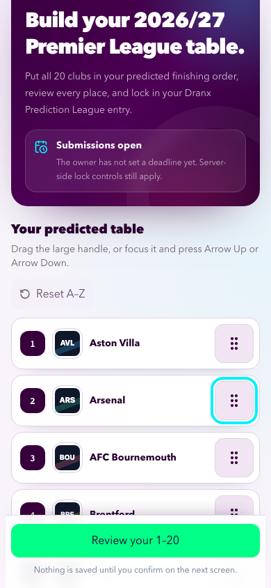
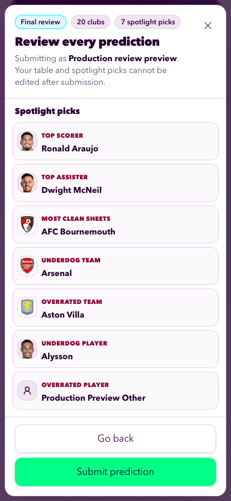
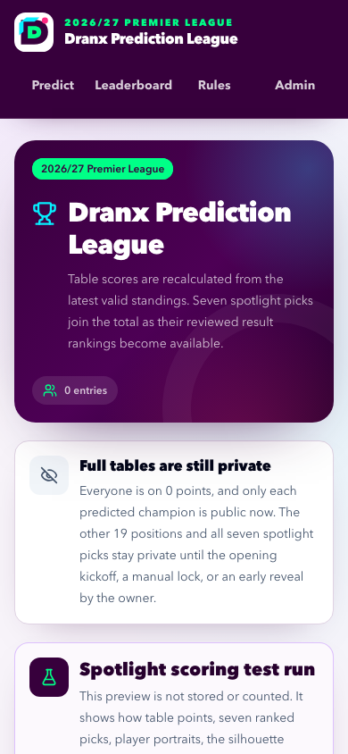
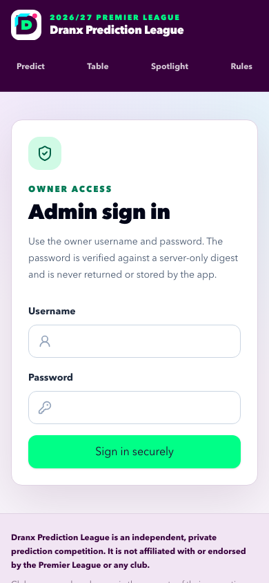

# Quality assurance

Evidence date: 2026-08-08. This document records the newest completed local and production verification for the seven-category spotlight prediction and reviewed player-catalogue release. GitHub PRs #7 and #8 are merged, the hash-only closeout deployment is live at the stable alias, and its final read/write browser proof is complete. Owner publication of the staged Web Application Firewall rate limit remains the only open release control; pending result feeds and the working category curve remain product follow-ups. Earlier release history remains in `docs/context/LOG.md`.

## Current results

| Gate                           | Command or environment                                                       | Result                                                                                                                                                                                                                                                                                                                                                                                                           |
| ------------------------------ | ---------------------------------------------------------------------------- | ---------------------------------------------------------------------------------------------------------------------------------------------------------------------------------------------------------------------------------------------------------------------------------------------------------------------------------------------------------------------------------------------------------------- |
| Focused Markdown formatting    | `npx prettier --check docs/QA.md docs/context/STATUS.md docs/context/LOG.md` | Passed for the three updated canonical records. HTML peers are regenerated separately by the canonical documentation workflow.                                                                                                                                                                                                                                                                                   |
| Complete local chain           | `CI=1 npm run check`                                                         | Passed on the tested feature revision: documentation and player-catalogue parity checks, formatting, ESLint, strict TypeScript, the default suite, isolated Neon integration, the Webpack production build, and both deterministic browser phases.                                                                                                                                                               |
| Unit/component/default suite   | `npm test` within the aggregate check                                        | 147 passed; 10 database cases were skipped by their explicit opt-in guard.                                                                                                                                                                                                                                                                                                                                       |
| Isolated Neon integration      | `npm run test:integration`                                                   | 10 passed through the fail-closed test-database wrapper. The atomic prediction case persists one parent, exactly 20 ordered table rows, and exactly seven spotlight rows or persists none.                                                                                                                                                                                                                       |
| Pre-kickoff browser phase      | deterministic Playwright phase                                               | 5 passed with 20 intentional project-routing skips across desktop Chromium, 320/390/430-pixel Chromium, and iPhone 13 WebKit.                                                                                                                                                                                                                                                                                    |
| Post-kickoff browser phase     | deterministic Playwright phase                                               | 3 passed with 2 intentional project-routing skips.                                                                                                                                                                                                                                                                                                                                                               |
| Reviewed player catalogue      | `npm run players:check` within the aggregate check                           | Exact reviewed result: 587 players across the 20 clubs, 580 local portrait PNGs, and seven intentional silhouette fallbacks.                                                                                                                                                                                                                                                                                     |
| Vercel production build        | deployment `dpl_HT2uPdP5iJPaWuYtNFEknroRmTqG`                                | Ready with target `production` for exact Git SHA `a9d1c12c804ff34db48450ff2e57bded64710022`. Its immutable URL and the stable alias both resolve to the hash-only closeout release.                                                                                                                                                                                                                              |
| Anonymous production smoke     | corrected `npm run test:production-smoke`                                    | 5 of 5 projects passed against the stable alias. The run covered the three-stage entry preview, player portraits and the Other-player silhouette, leaderboard demonstration, rules, administrator login, narrow reflow, and browser/network error guards.                                                                                                                                                        |
| Bounded production write smoke | hardened `npm run test:production-write-smoke`                               | 1 passed: one uniquely named 20-table-row plus seven-pick entry was submitted, kept private, authenticated through the owner login, and exact-deleted. The gated harness accepts only `PLAYWRIGHT_ADMIN_PASSWORD`, disables screenshots/traces/video, uses the list reporter, and left only `.last-run.json`; final production queries found zero parent, table-item, spotlight-pick, or deletion-audit residue. |
| Production database transition | migrations `0003` through `0005` plus idempotent seed                        | Production had zero pre-existing predictions. The migrations completed, 587 active catalogue players were seeded, 580 portrait paths and seven null portrait fallbacks were verified, and the bounded QA write left no residue.                                                                                                                                                                                  |
| Production mobile evidence     | mobile Chromium at 390 by 844 pixels                                         | The prediction, review, leaderboard, and administrator-login screenshots were refreshed and visually inspected.                                                                                                                                                                                                                                                                                                  |
| Administrator credential path  | live bounded write smoke                                                     | The configured administrator username plus salted PBKDF2-SHA-256 password hash authenticated successfully. The raw owner password was not written to source, logs, or documentation.                                                                                                                                                                                                                             |
| Legacy administrator fallback  | deployment metadata plus bounded login                                       | `ADMIN_SECRET` is absent from production, preview, and development inventories and from the running production deployment. `ADMIN_USERNAME` and `ADMIN_PASSWORD_HASH` are present, and the post-removal bounded login passed.                                                                                                                                                                                    |
| Administrator login WAF        | Vercel firewall inspection                                                   | The live log-only rule observed exactly four intended bounded-login `POST` requests and no enforced action. A 10-request-per-60-second, per-IP, HTTP-429 rate limit is staged but is not live; owner publication remains required.                                                                                                                                                                               |

The local environment uses the repository's verified Webpack production-build command because its restricted sandbox does not allow a default Turbopack helper to bind an internal port. Vercel built the release successfully, so this remains an execution-environment limitation rather than an application compile failure.

## Unit and component coverage

The 147-test default run covers the earlier table, season, standings, privacy, and administrator invariants plus the new spotlight scope:

- canonical seven-category taxonomy and exact-cardinality validation;
- club-only validation for most clean sheets, underdog team, and overrated team, plus player-only validation for top scorer, top assister, underdog player, and overrated player;
- first-name, last-name, and full-name player search, keyboard-accessible combobox behavior, and a required custom name for Other player;
- exact normalization of the owner-provided 587-player snapshot, canonical mapping to all 20 clubs, duplicate/unreferenced-asset rejection, 580 local portraits, and seven null portrait paths;
- `PlayerMark` portrait rendering with an accessible generic silhouette when a path is absent or a browser image fails;
- atomic acceptance of one prediction parent, all 20 ordered clubs, and exactly seven category picks;
- derived table scoring capped at 100, occupied category ranks, shared ranks, team expectation indexes, and opposite player-rating directions;
- authenticated exact prediction deletion, cascade behavior for all table items and spotlight picks, deletion audit preservation, and normalized-name reuse;
- PBKDF2-backed administrator login, malformed-hash and sentinel-value failure handling, legacy-fallback migration coverage, signed-session expiry/tamper protection, strict cookie attributes, and same-origin administrator mutations;
- pre-reveal privacy that withholds prediction identifiers, positions 2–20, and all seven spotlight picks from public HTML, RSC, and route payloads; and
- the existing database-clock cutoff, irreversible reveal, importer last-good preservation, standings finalization, and compare-and-swap race protections.

## Scoring behavior and open outcome inputs

The existing table score remains capped at 100. The implemented category curve currently converts occupied rank 1 through 20 into 20 through 1 points, with rank below 20 receiving zero. Seven first-place category results would therefore add 140 points for a 240-point overall maximum. This is an explicit working assumption awaiting owner confirmation, not a separately sourced competition rule. The predicted champion remains the club in table position 1 and has no separate bonus.

Team expectation outcomes are derivable from submitted tables plus actual standings. Underdog uses `average predicted position - actual position`; overrated uses the exact inverse. Each list is ranked largest first with full precision before the occupied-rank curve is applied.

Five category outcome rankings still require a reviewed source-neutral input: top scorer, top assister, most clean sheets, underdog player, and overrated player. The two player-opinion lists rank season-average player ratings in opposite directions—descending for underdog and ascending for overrated—once that reviewed input exists. Custom Other-player names also require owner reconciliation to the eventual outcome subjects. The roster import supplies selector identities and portraits only; it is not an outcome feed, and unavailable outcomes remain visibly pending rather than receiving zero points.

## Database and production data verification

The isolated Neon integration suite passed all ten cases through `scripts/run-with-test-database.mjs`. Its prediction lifecycle now proves that a successful write contains exactly one parent, 20 table rows, and seven spotlight rows; deletion cascades through both child sets. The other cases retain the deadline, lock serialization, revealed-season, last-good import, monotonic watermark, future-time, and active-pointer protections. The wrapper refuses to run against production, and deterministic clock overrides remain disabled outside the wrapper-attested test target.

Production was inspected before migration and contained zero predictions and zero prediction items; the player and category-pick tables did not yet exist. Migrations `0003`, `0004`, and `0005` then completed before the idempotent seed. Post-seed verification found 587 active players, 580 portrait paths, seven intentional null portrait paths, and both cross-season integrity triggers. The bounded write smoke subsequently created and removed only its unique QA entry. Final exact queries returned zero QA prediction parents, zero table items, zero category picks, and zero deletion-audit rows.

## Browser and mobile verification

The deterministic browser phases cover desktop Chromium, touch-enabled Chromium at 390 by 844, exact 320- and 430-pixel Chromium reflow, and iPhone 13 WebKit. Verified behavior includes:

- the complete three-stage path from ordering all 20 clubs, through seven spotlight selectors, to one review dialog and atomic submit;
- 56-pixel move handles, mouse/touch/keyboard table reorder, safe-area actions, long-name wrapping, and no document-level horizontal overflow;
- searchable keyboard-accessible player selectors using real catalogue names and images, including first-name and last-name queries;
- the Other-player text path and generic silhouette, while most clean sheets and the team-opinion categories show club crests rather than players;
- exactly seven spotlight rows in review, decoded real portraits for selected catalogue players, a rendered silhouette with no nested image for the custom player, and all 20 decoded club marks;
- receipt-only access before reveal and withholding of the other participant details from clean browser contexts and public serialization;
- the visible leaderboard scoring test run with real player names, real available portraits, club crests, and an intentional silhouette example;
- the rules page, administrator sign-in, exact submission deletion, deletion audit, and complete isolated cleanup; and
- the existing deterministic pre/post-kickoff table scores, champion status, standings import, finalization, and undo paths.

The production reruns exposed three harness-only browser boundaries, not product failures. A touch drag may finish without crossing the insertion boundary on its first attempt, so the smoke permits one bounded retry and still requires the club order to change. A browser may cancel a speculative optimized player-face candidate during navigation; the request guard excludes only that cancellation while the UI makes explicit rendered-image assertions. Finally, the rank-two Haaland demo starts in a closed details element while rank-one Jordan starts open, so the harness now keeps both details open before it requires Haaland's portrait to decode and Alysson's silhouette to contain no image. The corrected read-only production run then passed all five projects.

Automated WebKit emulation is strong regression evidence but is not a substitute for a final spot check on the owner's physical iPhone when one is available.

## Production deployment evidence

GitHub [PR #7](https://github.com/vdoshi96/Pl-predictions/pull/7) merged the product feature at `c976c1719c8c17f8169b9c8b86248765821b203a`; [PR #8](https://github.com/vdoshi96/Pl-predictions/pull/8) merged the hardened release evidence at `a9d1c12c804ff34db48450ff2e57bded64710022`. Deployment `dpl_HT2uPdP5iJPaWuYtNFEknroRmTqG` is Ready with target `production` at immutable URL [https://pl-predictions-dixkq8ma0-vdoshi96s-projects.vercel.app](https://pl-predictions-dixkq8ma0-vdoshi96s-projects.vercel.app). Its metadata identifies the exact PR #8 SHA, and the stable public alias [https://pl-predictions-2026.vercel.app](https://pl-predictions-2026.vercel.app) points to it. This record does not claim that GitHub `main` is the repository's configured default branch.

The corrected read-only production smoke passed 5 of 5 browser projects. It verified application health, the three-stage preview, seven completed picks, explicit decoded portrait/silhouette behavior, the visible leaderboard demonstration, the rules page, administrator sign-in, 320–430-pixel reflow, no horizontal overflow, and no unexpected browser, same-origin request, or HTTP response errors.

The separately gated production write smoke passed its one exact journey. Its production mode requires only the `PLAYWRIGHT_ADMIN_PASSWORD` environment value, disables screenshot, trace, and video artifacts, and uses the list reporter so the credential cannot leak into retained browser evidence. The hardened live run left only `.last-run.json` in its output/results locations. It submitted a unique complete entry, confirmed the receipt-only privacy boundary, authenticated with the username and PBKDF2-backed credential, exact-deleted the created prediction, verified the deletion audit, then removed that QA audit as part of teardown. Final queries again found zero parent, table-item, spotlight-pick, or deletion-audit residue from the run.

The successful post-removal login proves the configured hash path because deployment metadata contains `ADMIN_USERNAME` and `ADMIN_PASSWORD_HASH` but not `ADMIN_SECRET`. The legacy name is also absent from production, preview, and development environment inventories. The raw credential remained in macOS Keychain only and was never written to source, browser artifacts, logs, or documentation.

The live WAF rule remained in log mode for the verification and observed exactly four intended bounded administrator-login `POST` requests. The prepared change would enforce 10 requests per 60 seconds per IP with HTTP 429 on excess requests, but it remains staged under the owner-publication boundary and is not live.

## Production mobile screenshots

Only the newest completed production run is retained. All four screenshots were refreshed at 390 by 844 pixels and visually inspected for readable wrapping, reachable actions, painted local imagery, and absence of horizontal clipping.

**Prediction entry — mobile Chromium at 390 pixels:** stage one shows all 20 club crests in the mobile sorter after a verified keyboard move, with the display-name field and safe-area-aware spotlight action fitting the viewport.

**Review dialog — mobile Chromium at 390 pixels:** the complete review contains the ordered 20-club table and all seven spotlight categories. Assertions before capture verify real portraits for Cole Palmer, Declan Rice, and Elliot Anderson, plus the generic silhouette for the custom Other player.

**Leaderboard demonstration — mobile Chromium at 390 pixels:** the visible demo is labelled as a test run and uses real player selections and available portraits, club crests for club categories, and an intentional silhouette fallback without affecting real participant standings.

**Administrator sign-in — mobile Chromium at 390 pixels:** the owner-only username-and-password entry point reflows cleanly with labelled fields and a full-width action.

## Security and source review

- No environment value, receipt token, database URL, administrator credential, or subscription cookie is committed or exposed through a public variable.
- Administrator writes require both a valid signed session and exact same-origin request metadata. The configured password is stored as a salted PBKDF2-SHA-256 hash; the raw owner password is absent from source and documentation.
- Public pre-reveal data withholds prediction identifiers, positions 2–20, and all seven spotlight picks. The only intentional public projection remains the display name and predicted champion.
- A prediction is accepted only when one transaction can persist the parent, all 20 ordered team rows, and exactly seven category rows.
- The owner-provided raw roster handoff is normalized into reviewed local data and images. Its acquisition scripts are not used at runtime, and the application performs no live football API request, FotMob extraction, scraper, or Vercel Cron.
- The five pending result rankings will remain unavailable until a reviewed source-neutral input and Other-player reconciliation path are approved.
- The official Premier League logo/lion/ball assets remain excluded. The 20 owner-provided local club crests and imported player portraits are the only selector imagery used for this release, with the established labelled fallbacks.

## Release closeout state

- [x] Merge GitHub PR #7 into working `main` at exact SHA `c976c1719c8c17f8169b9c8b86248765821b203a`.
- [x] Merge PR #8 at `a9d1c12c804ff34db48450ff2e57bded64710022` and verify Ready production deployment `dpl_HT2uPdP5iJPaWuYtNFEknroRmTqG`, its immutable URL, exact SHA, and stable alias mapping.
- [x] Apply migrations `0003` through `0005`, seed and verify 587 players with 580 portraits and seven silhouettes, and prove there were zero pre-existing predictions.
- [x] Pass the corrected five-project read-only smoke and the one-case bounded write smoke with exact zero QA residue.
- [x] Refresh and visually inspect the newest four mobile screenshots.
- [x] Confirm username-plus-PBKDF2 authentication, remove `ADMIN_SECRET` from Vercel inventories, deploy without it, and pass the bounded owner-login check against that exact runtime.
- [ ] Obtain owner publication of the staged 10-per-60-second per-IP WAF rate limit; until then, the live rule remains log-only.
- [ ] Confirm or revise the working 20-to-1 category curve and 240-point maximum.
- [ ] Provide reviewed source-neutral inputs for the five pending outcome rankings and reconcile custom Other-player names.
- [x] Generate the HTML peers, publish the final evidence through working `main`, synchronize local and remote `main`, remove completed branch state, and retain one primary worktree. The self-referential final evidence merge SHA is intentionally not pinned here.
