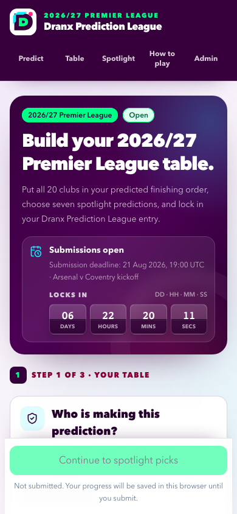
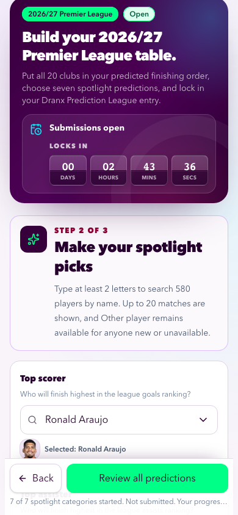
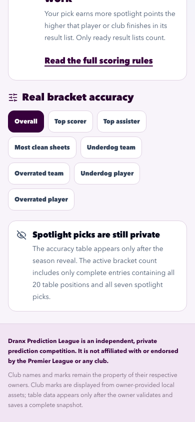
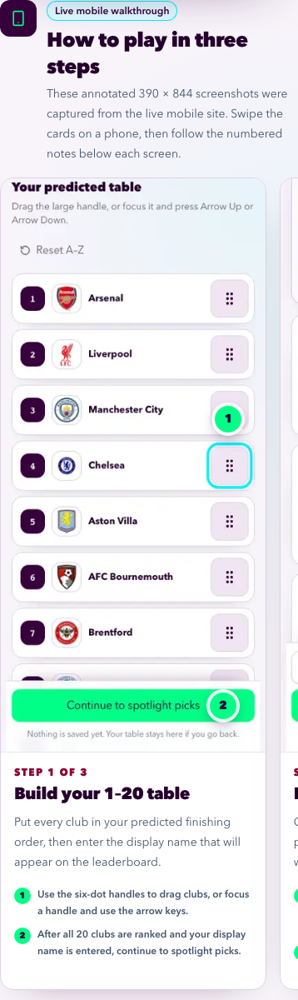

# Quality assurance

Evidence date: 2026-08-08. This document records the newest verification for the annotated how-to, database-time countdown, complete retained test entry, and removal of the hard-coded spotlight demonstration. Earlier release history remains in `docs/context/LOG.md`.

## Current results

| Gate                      | Command or environment                                            | Result                                                                                                                                                                                                                                                                                                                     |
| ------------------------- | ----------------------------------------------------------------- | -------------------------------------------------------------------------------------------------------------------------------------------------------------------------------------------------------------------------------------------------------------------------------------------------------------------------- |
| Complete local chain      | `CI=1 npm run check`                                              | Passed documentation/player parity, formatting, ESLint, strict TypeScript, 150 default tests with 10 guarded skips, all 10 isolated Neon integration tests, the Webpack production build, five pre-kickoff browser projects with 20 intentional skips, and three post-kickoff browser projects with two intentional skips. |
| Reviewed player catalogue | `npm run players:check` within the aggregate check                | Verified 582 players, 582 portraits, and zero silhouette fallbacks on the 2026-08-13 roster branch.                                                                                                                                                                                                                        |
| Production data preflight | read-only aggregate query plus public page inspection             | Found zero prediction parents, table items, or spotlight picks before the requested test entry. Alex and Jordan existed only in a hard-coded component, not in Neon.                                                                                                                                                       |
| Retained production entry | supported public three-stage form                                 | Created `Dranx Test Entry`; follow-up verification found one parent with exactly 20 ordered table rows and seven spotlight rows. The public table leaderboard shows one entry, while unrevealed private picks remain absent from `/spotlight`.                                                                             |
| Live how-to sources       | mobile Chromium at 390 by 844 pixels                              | Captured stage 1, stage 2, and final review from the public live flow without submitting the walkthrough draft. All three PNGs were visually inspected.                                                                                                                                                                    |
| Production deployment     | Vercel production deployment `dpl_2L4cprnsWShhesujY7sTLKffywhg`   | Ready at the immutable URL recorded below after GitHub PR #13 merged to `main`. Read-back proved the stable public alias resolves to this deployment.                                                                                                                                                                      |
| Production release smoke  | `npm run test:production-smoke` against the immutable URL         | Passed 5 of 5 projects: desktop Chromium, 390-pixel mobile Chromium, exact 320/430-pixel Chromium reflow, and mobile WebKit. A second read-only mobile Chromium pass captured the dedicated countdown artifact.                                                                                                            |
| Production runtime logs   | exact-deployment error and HTTP 500 queries, preceding 30 minutes | Both queries returned no records after the smoke run.                                                                                                                                                                                                                                                                      |

The first aggregate-check attempt stopped at Prettier before lint, tests, integration, or build ran. After formatting the one flagged mobile test, the clean uninterrupted run above passed. The local environment uses the repository's verified Webpack build because the restricted sandbox does not permit a default Turbopack helper to bind its internal port.

## Feature coverage

The default, integration, and browser suites now cover:

- a compact four-tile days/hours/minutes/seconds countdown beside the open-submissions status;
- database-time-derived initial duration, monotonic elapsed-time updates, zero clamping, padded digits, and exactly one server refresh at zero;
- the three-card live-mobile how-to section, all three images, numbered callouts, renamed navigation, and the `How to play & scoring` page heading;
- 320-, 390-, and 430-pixel Chromium reflow plus iPhone WebKit, with no document-level horizontal overflow;
- the complete journey from 20-club ordering through seven spotlight selectors to one review and atomic submit;
- pre-reveal privacy for prediction identifiers, positions 2–20, all seven spotlight subjects, and hidden accuracy ordering;
- absence of the former Alex/Jordan component and its dedicated demo assertions; and
- the existing 56-pixel mouse/touch/keyboard reorder handles, searchable selectors, Other-player path, safe-area action, long-name wrapping, table scoring, standings, administrator deletion, and compare-and-swap protections.

The countdown is an informational display. The server calculates its starting duration from PostgreSQL time, while the atomic submission statement still locks the season and rechecks PostgreSQL `clock_timestamp()` against the effective deadline. Device-clock changes or a stale open page therefore cannot authorize a late write.

## Production data verification

Read-only live inspection established the baseline before any requested mutation:

- `/leaderboard` showed no entries;
- `/spotlight` showed zero active brackets but rendered Demo Alex and Demo Jordan;
- the production database contained zero prediction parents, zero table items, and zero category picks.

Source tracing proved the two names were rendered unconditionally by `src/features/leaderboard/leaderboard-demo.tsx`. They were never partial stage-two submissions, so deleting database rows would have been both unnecessary and incorrect. The release removes the import, render path, component, and demo-specific tests.

The retained `Dranx Test Entry` was then submitted through the public three-stage UI. It contains:

- 20 ordered clubs, headed by Arsenal, Liverpool, Manchester City, and Chelsea;
- top scorer Erling Haaland;
- top assister Bruno Fernandes;
- most clean sheets Arsenal;
- underdog team Sunderland;
- overrated team Manchester United;
- underdog player Chris Rigg; and
- overrated player Alysson.

The final post-release database verification exposed only safe aggregate facts: one parent, 20 child positions, seven category picks, and the sole display name `Dranx Test Entry`. It found no display name containing Alex or Jordan. It did not print prediction IDs, receipt material, database URLs, private pick subjects, or credentials. Before reveal, the public spotlight page reports one active bracket but does not serialize or display those seven choices.

## Annotated live-mobile walkthrough

The participant-facing `/rules` section uses three first-party captures from the live 390 by 844 public flow:

1. `public/how-to-play/step-1-table-mobile.png` — ordered club table, reorder handles, display-name field, and continue action.
2. `public/how-to-play/step-2-spotlight-mobile.png` — selected player/club controls and the review action.
3. `public/how-to-play/step-3-review-mobile.png` — the complete 20-position and seven-pick review with the final submit action.

Each image receives two numbered overlay pins at render time. The same numbers and instructions appear as adjacent HTML text, so the annotations remain accessible, selectable, responsive, and understandable without colour. The walkthrough draft used the unsaved display name “How to play preview”; it never created a second production entry.

## Production deployment and mobile evidence

GitHub [PR #13](https://github.com/vdoshi96/Pl-predictions/pull/13) merged the tested feature into `main` at `a7785b9b16b64be825e06ef8f181ab5f98031524`. Vercel production deployment `dpl_2L4cprnsWShhesujY7sTLKffywhg` is Ready at [https://pl-predictions-9h7r762li-vdoshi96s-projects.vercel.app](https://pl-predictions-9h7r762li-vdoshi96s-projects.vercel.app). The standard release alias command moved [https://pl-predictions-2026.vercel.app](https://pl-predictions-2026.vercel.app) to that exact deployment, and deployment-ID read-back verified the mapping.

The final read-only smoke passed all five browser projects against the immutable URL. It exercised the timer, all three entry stages without submitting, the table leaderboard, private pre-reveal spotlight state, absence of Alex/Jordan fixtures, the annotated how-to, administrator login, 320–430-pixel reflow, WebKit, local imagery, no horizontal overflow, and browser/network/HTTP guards. The exact-deployment error-level and HTTP 500 log queries returned no records in the preceding 30 minutes.

Only the newest completed production run is retained under `docs/assets/qa/`. All seven artifacts were visually inspected for readable type, clear hierarchy, painted local imagery, reachable actions, correct annotations, and absence of clipping.

**Submission countdown — mobile Chromium at 390 by 844:** the compact calendar-flip timer is prominent inside the open-submissions card without overwhelming the hero or first-stage action.

**Prediction sorter — mobile Chromium at 390 by 844:** the reordered table, 56-pixel handle, painted crests, and sticky continue action fit without horizontal overflow.

**Spotlight stage — mobile Chromium at 390 by 844:** all seven selector values are prepared and the review action remains reachable above the safe area.

**Final review — mobile Chromium at 390 by 844:** the preview shows the 20-club and seven-pick counts, real portraits, club crests, the custom-player silhouette, and the submit action. The smoke closes this preview without submitting.

**Private spotlight state — mobile Chromium at 390 by 844:** the page exposes category navigation and its complete-bracket privacy explanation, with no Alex/Jordan fixture or real pick subjects.

**Rendered how-to annotations — 358 by 1200 element capture from mobile Chromium:** the first live-mobile card shows numbered overlay pins and matching textual instructions; the next card remains discoverable at the horizontal edge.

**Administrator sign-in — mobile Chromium at 390 by 844:** the owner-only credential form and navigation reflow cleanly.

## Security and cleanup boundaries

- No environment value, receipt token, database URL, administrator credential, or subscription cookie is committed or printed.
- Production creation was limited to the explicitly requested retained test entry. The destructive production-write smoke was not used because that harness intentionally deletes its QA entry.
- The retained entry followed the same atomic write path as every participant: parent plus 20 table rows plus seven spotlight rows, or nothing.
- Alex/Jordan removal is a code cleanup, not a data deletion. No legitimate production submission was deleted.
- Public pre-reveal output continues to expose only the permitted table-leaderboard projection and complete-bracket count.
- The owner-provided raw roster and club-asset handoffs remain untouched and untracked.

## Release closeout state

- [x] Implement and locally verify the countdown, annotated walkthrough, navigation copy, and fixture removal.
- [x] Create and verify one complete retained production test bracket.
- [x] Pass the uninterrupted full local verification chain.
- [x] Merge GitHub PR #13 into `main` and verify the Ready production deployment plus stable alias mapping.
- [x] Pass the final five-project read-only production smoke, visually inspect all seven newest screenshots, and find no error-level or HTTP 500 records in the tested window.
- [x] Regenerate final HTML peers, publish this closeout through `main`, synchronize local and remote `main`, and remove completed branch state.
