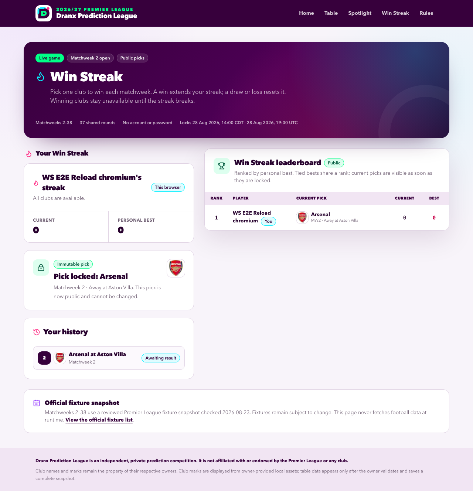
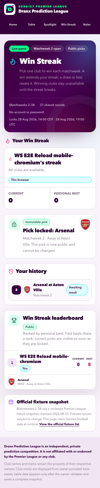
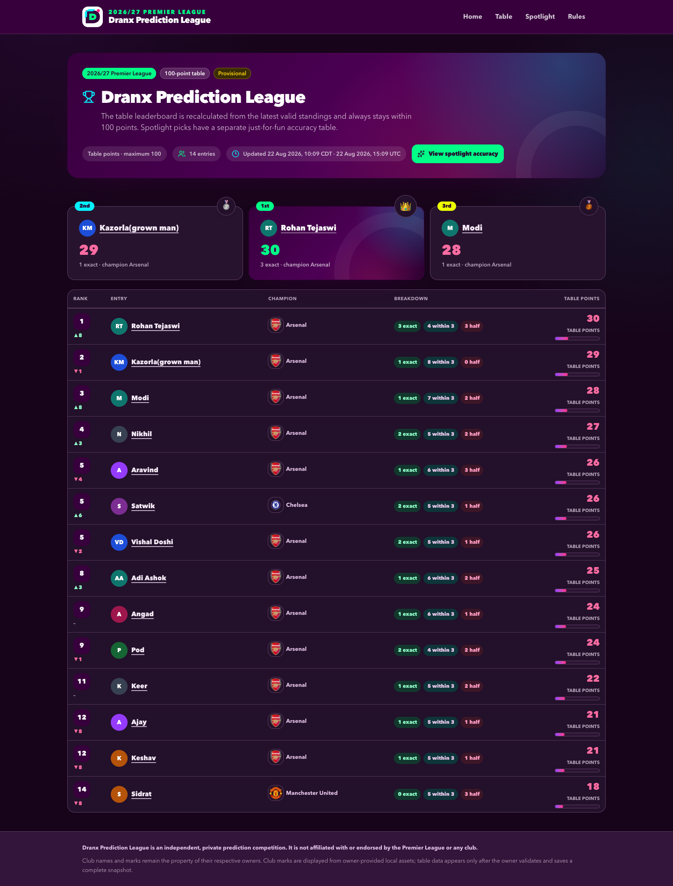
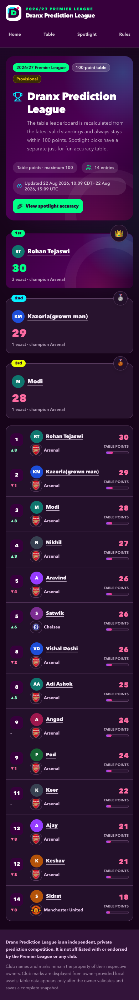
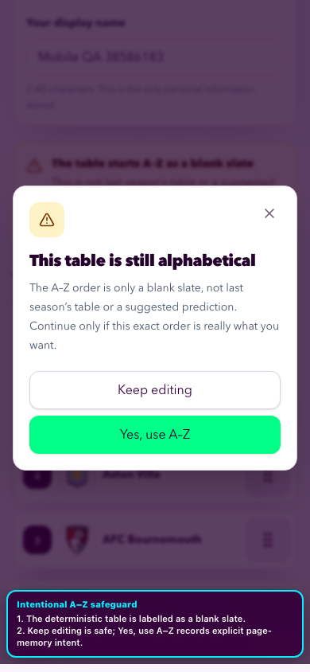
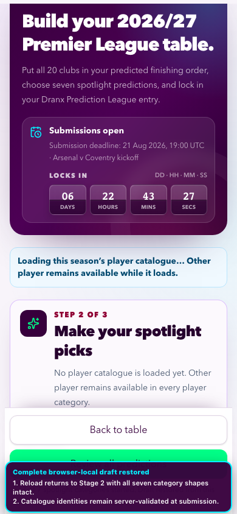
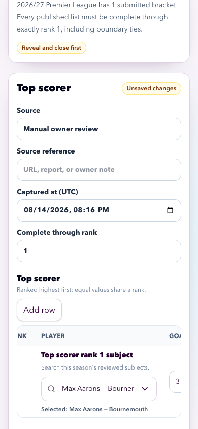
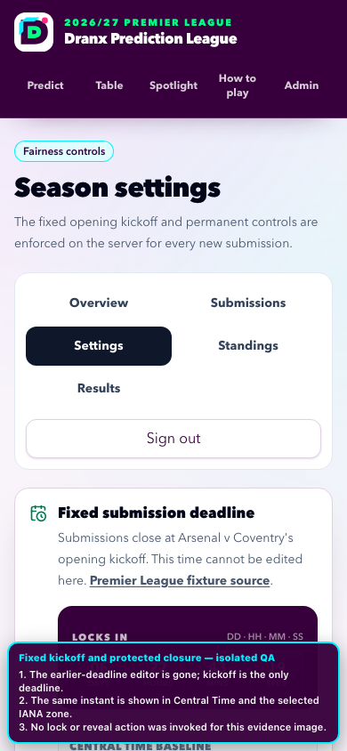

# Quality assurance

## August 31 production results

The owner-run update published reviewed Matchweek 2 facts, resolved the completed Win Streak round atomically, and verified the live public views.

| Gate                        | Evidence                                                                                                                                                                                                                                                                                                                                                                                                                                     |
| --------------------------- | -------------------------------------------------------------------------------------------------------------------------------------------------------------------------------------------------------------------------------------------------------------------------------------------------------------------------------------------------------------------------------------------------------------------------------------------- |
| Fixture and match preflight | `npm run win-streak:fixtures:check` verified 370 fixtures across 37 matchweeks with no drift or write. FotMob reported all 10 Matchweek 2 fixtures final, including Aston Villa 0-1 Arsenal.                                                                                                                                                                                                                                                 |
| Production publication      | The authenticated administrator workflow published 20 standings rows, 14 scorer rows, 14 assister rows, 20 clean-sheet rows, and 18 reviewed ratings. Goals, assists, and clean sheets record `covered_through_rank = 14`. Four picked players remain absent from the rating facts and display as N/A.                                                                                                                                       |
| Database reconciliation     | Active equals working for sealed goals snapshot `fc93b34a-77d6-41ae-bc35-fcbd95e600a0`, assists `114b6a29-1b8c-46a7-8714-c9b9a1b1cfc7`, clean sheets `b1e038a1-cf6b-4ac8-bfe1-7c241b81e388`, and ratings `e364b977-b15e-4ef0-ba54-790e99af1b51`. Every final pointer remains `NULL`. Source checks include Bruno Fernandes at three goals, Rayan Cherki at two assists, Arsenal at two clean sheets, and Bruno Fernandes at an 8.630 rating. |
| Win Streak transition       | The authenticated action stored exactly 10 Matchweek 2 outcomes in one transition: seven decisive home or away wins and three draws, with no voids. Both Manchester United picks won. The database and public page show Rohan Tejaswi and Vishal Doshi tied first with current and best streaks of one, Matchweek 3 open, and no current picks.                                                                                              |
| Production browser          | Ready deployment `dpl_HLqSB2C8vJpyMUpEeajMhY8YBabd` served the stable domain during data verification. The table shows Adi Ashok at 39, Angad at 38, and Aravind at 36. Keshav leads Spotlight with 82 points. Every category board is live. Desktop and 390-pixel checks found no console warnings or failed application requests.                                                                                                          |
| Administrator-path defect   | Next.js 16.3 rejects the tracked `/admin/win-streak` server-action module because its `"use server"` file exports a client initial-state object. A temporary local-only module split let the same authenticated action run against the verified live database. The tracked source was restored afterward. Fix the export before the next Win Streak result run.                                                                              |
| Release boundary            | No fixture rewrite, targeted seed, runtime football client, direct result write, schema migration, finalization, `LOCK`, `REVEAL`, protected-round change, or unrelated application release ran.                                                                                                                                                                                                                                             |

## August 30 production results

The owner-run update published reviewed Matchweek 1 and partial Matchweek 2 facts without advancing the incomplete Win Streak round.

| Gate                        | Evidence                                                                                                                                                                                                                                                                                                                                                                        |
| --------------------------- | ------------------------------------------------------------------------------------------------------------------------------------------------------------------------------------------------------------------------------------------------------------------------------------------------------------------------------------------------------------------------------- |
| Fixture and match preflight | `npm run win-streak:fixtures:check` verified 370 fixtures across 37 matchweeks with no drift or write. FotMob reported nine of 10 Matchweek 2 fixtures final. Aston Villa-Arsenal remains scheduled for August 31, 2026, so the all-10 gate prevented a partial Win Streak transition.                                                                                          |
| Production publication      | The authenticated administrator workflow published 20 standings rows, 14 scorer rows, 14 assister rows, 20 clean-sheet rows, and 17 reviewed ratings. Goals, assists, and clean sheets record `covered_through_rank = 14`. Five picked players remain absent from the rating facts and display as N/A.                                                                          |
| Database reconciliation     | Read-only comparison found zero source mismatches. Active equals working for sealed goals snapshot `5c8287d4-2443-446a-8ce3-7fe39e134f8c`, assists `43c1084b-4dc9-4347-a0b0-8ae8c327de7a`, clean sheets `367f4e8b-64fa-496f-8507-b6ba6c5dcec4`, and ratings `496bbada-9393-447e-a9f5-1e419b2ed625`. Every final pointer remains `NULL`.                                         |
| Production browser          | Ready deployment `dpl_D6fxyz1ixQ5DGRDXc9rbYpvuurwJ` served the stable domain during data verification. The table shows Angad at 36, Keer at 33, and Ajay and Aravind at 32. Aravind and Keshav share the 80-point Spotlight lead. Every category board is live. Desktop and 390-pixel checks found no console errors, HTTP failures, mutation requests, or horizontal overflow. |
| Win Streak boundary         | Matchweek 2 remains unresolved with 10 stored fixtures, zero results, two picks, and no voids. The public leaderboard shows Rohan Tejaswi and Vishal Doshi tied at 0, each with a Manchester United pick. No Win Streak result mutation ran.                                                                                                                                    |
| Release boundary            | No fixture rewrite, targeted seed, runtime football client, direct result write, schema migration, finalization, `LOCK`, `REVEAL`, protected-round change, or unrelated application change ran.                                                                                                                                                                                 |

## August 29 production results and stable routing

The owner-run update publishes reviewed provisional facts after the fixture and live-match gates pass. The shared production address is a project domain that follows successful deployments from GitHub `main`.

| Gate                         | Evidence                                                                                                                                                                                                                                                                                                                                                                                                                                                                                                                                                                                                                                                            |
| ---------------------------- | ------------------------------------------------------------------------------------------------------------------------------------------------------------------------------------------------------------------------------------------------------------------------------------------------------------------------------------------------------------------------------------------------------------------------------------------------------------------------------------------------------------------------------------------------------------------------------------------------------------------------------------------------------------------- |
| Fixture preflight            | `npm run win-streak:fixtures:check` verified 370 fixtures across 37 matchweeks with no drift and no write. FotMob reported no active match. Five of 10 Matchweek 2 fixtures were final, so the all-10 Win Streak gate correctly prevented a partial round update.                                                                                                                                                                                                                                                                                                                                                                                                   |
| Production publication       | The authenticated administrator workflow published 20 standings rows, 14 scorer rows, 14 assister rows, 20 clean-sheet rows, and 17 reviewed ratings. Goals, assists, and clean sheets retain `covered_through_rank = 14`. Five picked players remain absent and display as N/A. No final pointer moved.                                                                                                                                                                                                                                                                                                                                                            |
| Database reconciliation      | Independent read-only queries matched every published source value and competition rank. Active equals working for sealed goals snapshot `8821c142-2e97-4341-9e0a-3af20dc5c6f4`, assists `f41817f7-aeab-475d-bc50-5e5f0754a03a`, clean sheets `8853ce2a-5c0f-4042-9593-426eed7f3bd9`, and ratings `a3e9b0af-a195-4aba-adc5-aa74042f9ea8`. All final pointers remain `NULL`.                                                                                                                                                                                                                                                                                         |
| Local and production browser | Both rendered sites returned `200`, showed 14 table and Spotlight entries, and supported every category sort. Ajay leads the table with 37 points. Keshav leads Spotlight with 87 points. Nine entries have seven available results, and five have six. The player views visibly contain six underdog-pick and four overrated-pick N/A occurrences. Win Streak shows two profiles at 0.                                                                                                                                                                                                                                                                             |
| Stable production domain     | Vercel stores `pl-predictions-2026.vercel.app` as a verified project domain with no Git branch or custom-environment override. The project uses GitHub repository `vdoshi96/Pl-predictions`, production branch `main`, automatic Git deployments, and automatic custom-domain assignment. After conversion, the shared domain moved from stale deployment `dpl_5znWdTiecQjPMyyS56qBVc4YiAcv` to production deployment `dpl_Fsrr1CrYfymai5uWne83wrBEio1K`. PR #48 then merged as `19188058dec7d91c4418da9a32bf8abe075280f2`; Ready production deployment `dpl_7KcMtha9qXnribCCVyoFRRXApdRh` acquired the shared domain automatically without a manual alias command. |

## August 28 reviewed rating subsets

The production rating workflow publishes reviewed facts without fabricating values for players who have not received a rating. Missing picked players display as N/A and remain absent from ranks and accuracy totals.

| Gate                       | Evidence                                                                                                                                                                                                                                                                                                                                                                                                               |
| -------------------------- | ---------------------------------------------------------------------------------------------------------------------------------------------------------------------------------------------------------------------------------------------------------------------------------------------------------------------------------------------------------------------------------------------------------------------- |
| Contract tests             | The focused unit/component set passes 30 tests. The full unit/component run passes 422 tests with 31 guarded skips. Coverage includes subset validation, unpicked-row rejection, enabled review, administrator N/A copy, category cards, the matrix, entry pick details, and no-score omissions.                                                                                                                       |
| Static and database checks | Documentation parity for 18 generated pairs, the 580-player/578-portrait validator, Prettier, ESLint, strict TypeScript, the exact four-test isolated Spotlight integration suite, and the Webpack production build pass. The aggregate gate reaches the real Matchweek 2 deadline and exposes two unrelated Win Streak database tests plus related browser journeys that still assume the round is open.              |
| GitHub and deployment      | [PR #46](https://github.com/vdoshi96/Pl-predictions/pull/46) passed Vercel preview checks and merged as `e852d717ed6af12cd54916e5e0ec5475abce3f98`. Exact production deployment `dpl_5bVFdeCYjckhPwPWe2gSHYMo6YMi` is Ready at [its immutable URL](https://pl-predictions-hdaopixm0-vdoshi96s-projects.vercel.app).                                                                                                    |
| Production data            | Authenticated publication created sealed provisional snapshot `3bd5c440-0add-4de2-800c-e5757e21efea`. Read-only reconciliation confirms source FotMob, `covered_through_rank = 14`, active equals working, no final pointer, 15 exact reviewed facts, seven absent N/A players, and no source mismatches.                                                                                                              |
| Production browser         | A real browser against the exact deployment shows both opinion-player categories live. Martin Ødegaard leads underdog player at 8.580; Igor Thiago leads overrated player at 6.560. Seven named players render N/A with no rank or points. Keshav leads overall with 90 points; seven entries show seven of seven results available and seven show six of seven. The main table remains led by Ajay and Kazorla at 32. |
| Alias diagnosis            | `pl-predictions-2026.vercel.app` resolves to August 24 deployment `dpl_5znWdTiecQjPMyyS56qBVc4YiAcv`, while the automatic main and project aliases resolve to the August 28 deployment. The stable address is a separately assigned alias and does not move with GitHub main deployments. Reassignment remains an explicit owner action.                                                                               |

## August 24 picked-subject opinion rankings

The four opinion categories now rank within separate category-specific pools of distinct picked subjects. Team expectation indexes still use every complete bracket, and player ratings still come from the active sealed factual snapshot. The implementation filters those inputs at read time, so existing ranks can change without rewriting a result snapshot.

| Gate                       | Evidence                                                                                                                                                                                                                                                                                                                                                                                                                                                                                                                                                                                                                                                                                                                                                                                                                                                                                                |
| -------------------------- | ------------------------------------------------------------------------------------------------------------------------------------------------------------------------------------------------------------------------------------------------------------------------------------------------------------------------------------------------------------------------------------------------------------------------------------------------------------------------------------------------------------------------------------------------------------------------------------------------------------------------------------------------------------------------------------------------------------------------------------------------------------------------------------------------------------------------------------------------------------------------------------------------------- |
| Test-first behavior        | The focused pre-implementation run failed six assertions for unpicked-subject influence and missing-rating handling. The completed unit/component suite passes 419 tests with 33 guarded skips across 67 passed and five skipped files. Coverage includes duplicate picks, separate category pools, shared competition ties, opposite rating directions, unchanged current-`N` points, exact rating-draft subjects, synchronized edits, filtered paste, completeness copy, and publish rejection.                                                                                                                                                                                                                                                                                                                                                                                                       |
| Isolated database          | All 31 integration tests pass across five files. The opinion-category cases prove that unpicked and opposite-category subjects cannot affect a rank, resolved Other aliases join only the relevant pool, missing picked ratings stay pending, entry details use the global season pool, and deleting the sole pick recalculates eligibility. The fail-closed runner targeted the configured isolated Neon database.                                                                                                                                                                                                                                                                                                                                                                                                                                                                                     |
| Static and build gates     | Documentation parity passes for 18 Markdown/HTML pairs. The 580-player/578-portrait validator, Prettier, ESLint, strict TypeScript, and the Next.js 16 Webpack production build pass.                                                                                                                                                                                                                                                                                                                                                                                                                                                                                                                                                                                                                                                                                                                   |
| Focused browser acceptance | The optimized production-server journey passes desktop Chromium and exact 320- and 430-pixel Chromium. It exercises `/spotlight`, a revealed `/entries/[id]` detail, and `/admin/results`; confirms the two player-rating views contain only their respective picked-player pools after union seeding; and finds no page-level horizontal overflow. The first strengthened run exposed a 526-pixel administrator-table overflow at both mobile widths; stacked mobile editor rows fixed it before the final three-project pass. The server emitted the repository's documented destination-stream closure diagnostics while all final assertions passed.                                                                                                                                                                                                                                                |
| GitHub and deployment      | [PR #43](https://github.com/vdoshi96/Pl-predictions/pull/43) passed both Vercel checks and merged as `0abe166dc043820dc5201c9d6219b52a3fb39742`. Exact production deployment `dpl_5znWdTiecQjPMyyS56qBVc4YiAcv` became Ready at [its immutable URL](https://pl-predictions-5qo9i5lbh-vdoshi96s-projects.vercel.app). The documented [stable production alias](https://pl-predictions-2026.vercel.app) was explicitly assigned, and deployment-ID read-back proved the mapping.                                                                                                                                                                                                                                                                                                                                                                                                                          |
| Production acceptance      | The guarded anonymous smoke passed desktop Chromium, 390-pixel mobile Chromium, exact 320/430-pixel Chromium reflow, and mobile WebKit with only read-only same-origin methods. A separate raw-SQL recomputation produced all four picked-subject pools directly from revealed picks, the active standings, and the active rating snapshot. It matched 112 rendered entry assignments across desktop and 390-pixel mobile, including pending picked players without ratings, and found exact document containment. Bounded exact-deployment error, fatal, and HTTP-500 log queries returned no records.                                                                                                                                                                                                                                                                                                 |
| Production immutability    | Read-only capture at `2026-08-25T02:23:18.996448Z`, WAL `0/FA28990`, found zero tracked season rows created or updated after the deployment cutoff. The 14 prediction parents, 280 table rows, and 98 category picks remained intact. Standings retained active snapshot `53a81348-c10a-52ed-9e84-c100ab7852fb`, eight snapshots, and 160 facts. Active/working result pointers remained goals `cf8d8f0f-6eef-4f68-aff4-0ba73975d3b7`, assists `7ab74287-33d0-45ed-8353-2667d3d8eb1f`, clean sheets `3d973c79-bdbf-487c-896d-2b6d6181e511`, and ratings `3ce246be-d8fc-40a0-bcdf-94a3734b514d`. The database retained 32 result snapshots, 1,883 facts, zero live or pinned aliases, no final pointer, and 75 existing audits. No migration, seed, result republish, snapshot transition, participant write, administrator action, lock, reveal, standings import, or production database mutation ran. |

## August 23 complete UI/UX audit and motion remediation

The interaction-first audit covers all 13 user-interface routes across public, receipt-only, authenticated administrator, desktop, and mobile states. The canonical [audit report](ux-audit-2026-08-23.md) contains the complete findings, interaction manifest, scenario battery, responsive matrix, and before/after evidence. Production served as the read-only baseline; all participant writes and administrator previews used the isolated test database.

| Gate                                  | Evidence                                                                                                                                                                                                                                                                                                                                                                                                                                                                                                                             |
| ------------------------------------- | ------------------------------------------------------------------------------------------------------------------------------------------------------------------------------------------------------------------------------------------------------------------------------------------------------------------------------------------------------------------------------------------------------------------------------------------------------------------------------------------------------------------------------------ |
| Complete product walkthrough          | 117 timestamped manifest entries, 47 interaction-first snapshots, 113 screenshots, 35 console reads, and 30 network probes cover prediction submission, receipt authorization, leaderboard reflection, Win Streak creation and immutable pick submission, and all six administrator routes.                                                                                                                                                                                                                                          |
| Accessibility and responsive behavior | The original Rules carousel produced one serious axe violation and eight pixels of document overflow at 768 pixels. The remediated optimized build reports zero Critical or Serious axe violations and exact document containment at 320, 375, 768, 1,024, 1,280, and 1,920 pixels.                                                                                                                                                                                                                                                  |
| Visual and motion review              | The Impeccable detector reports no warnings in the changed UI. Search surfaces, prediction stages, confirmation dialogs, overlays, and submission success now use shared calibrated motion. Reduced-motion emulation resolves every tested state immediately.                                                                                                                                                                                                                                                                        |
| Component regressions                 | Focused tests cover the carousel's named keyboard target, selector open/close retention and assistive-technology boundary, staged prediction panels, and success acknowledgement. The final full unit run passed 414 tests with 31 guarded skips across 67 passed and five skipped files.                                                                                                                                                                                                                                            |
| Aggregate repository gate             | The uninterrupted final `CI=1 npm run check` passed 18 Markdown/HTML pairs, the 580-player/578-portrait validator, Prettier, ESLint, strict TypeScript, 414 unit/component tests, all 29 isolated Neon integration tests, the Next.js 16 Webpack production build, 24 pre-kickoff browser journeys with 26 intentional routing skips, and three post-kickoff journeys with two intentional skips. The optimized browser server emitted the repository's documented destination-stream closure messages while every assertion passed. |
| Isolated data cleanup                 | Exact-name cleanup removed two audit prediction parents with 40 table rows and 14 spotlight picks, plus two audit Win Streak profiles with two picks. Cascades were verified at zero residue; Win Streak rate-limit rows and administrator sessions were also zero after cleanup.                                                                                                                                                                                                                                                    |
| GitHub and deployment                 | [PR #41](https://github.com/vdoshi96/Pl-predictions/pull/41) passed both Vercel checks and merged as `a09798709e461fff511ea4712a3b1a8bb9649f86`. Exact deployment `dpl_2c3dpxwrtkPhQNbqRRyga8ti3QDb` became Ready at [its immutable URL](https://pl-predictions-d35jddef5-vdoshi96s-projects.vercel.app). The documented [stable production alias](https://pl-predictions-2026.vercel.app) was explicitly assigned, and deployment-ID read-back proved the mapping.                                                                  |
| Production acceptance                 | The guarded read-only smoke passed all five browser projects first against the exact deployment and again through the stable alias. A separate 12-route desktop/mobile audit found zero axe violations, document overflow, console warnings/errors, or HTTP failures. The final after screenshots were recaptured from the stable site. Exact-deployment 15-minute error, fatal, and HTTP 500 log queries returned no records.                                                                                                       |
| Production safety                     | Production verification used only anonymous GET, HEAD, and OPTIONS requests; the smoke fails on any same-origin mutation method. No migration, seed, participant write, administrator action, lock, reveal, standings import, result publication, or production database mutation ran.                                                                                                                                                                                                                                               |
| Open product decision                 | A receipt holder can open the private confirmation URL, but cannot rediscover it from public pages after leaving the success card. Any recovery design must preserve the existing rule that unrevealed entry identifiers never enter public HTML or leaderboard projections.                                                                                                                                                                                                                                                         |

## August 23 Win Streak production release

Win Streak is released for Matchweeks 2–38. Its leaderboard is public before name entry and publishes each participant's current-matchweek pick. The screenshots use isolated QA profiles rather than production data.

| Gate                       | Evidence                                                                                                                                                                                                                                                                                                                                                                                                                                                                                                                                                                                                                                                                                                              |
| -------------------------- | --------------------------------------------------------------------------------------------------------------------------------------------------------------------------------------------------------------------------------------------------------------------------------------------------------------------------------------------------------------------------------------------------------------------------------------------------------------------------------------------------------------------------------------------------------------------------------------------------------------------------------------------------------------------------------------------------------------------- |
| Fixture contract           | The generator parses and validates all 380 official fixtures, then retains Matchweeks 2–38: 37 rounds, 370 unique fixtures, ten fixtures and all 20 clubs per round, canonical team slugs, and normalized hash `0e8e868e2a53d31a57a568ffdffa1b0dccaec14f1e3a38ad3e93092e61998a0c`. It retains explicit UK times, defaults date-only weekend and bank-holiday fixtures to 15:00, midweek fixtures to 20:00, and Matchweek 38 to 16:00, then converts `Europe/London` to UTC. The online `win-streak:fixtures:check` passed on August 28 after it incorporated the safe future kickoff change for Manchester City-Sunderland in Matchweek 5. Matchweek 2 starts August 28, so no result backfill is due.                |
| Domain and component tests | The final full unit/component run passed 413 tests with 31 guarded skips across 67 files. Coverage includes parsing, profile switching, name takeover denial, immutable picks, every result transition, club restriction and unlocking, missed and void rounds, shared competition ranks, all 20 marks, keyboard confirmation, public picks, persistence, reset behavior, and fixture-drift safety.                                                                                                                                                                                                                                                                                                                   |
| Database integration       | All 29 isolated Neon integration tests passed across five files after migrations `0000`–`0010` and targeted fixture seeding. They cover atomic profile and pick constraints, database-time deadlines, receipt authorization, consistent public reads, safe fixture refresh, exact ten-result publication, immutable replay protection, audit creation, and zero cleanup residue.                                                                                                                                                                                                                                                                                                                                      |
| Static and build gates     | The uninterrupted final `CI=1 npm run check` passed parity for 17 Markdown/HTML pairs, the 580-player/578-portrait validator, Prettier, ESLint, strict TypeScript, 413 unit/component tests with 31 guarded skips, all 29 isolated Neon integration tests, the Next.js 16 Webpack production build, and both browser phases. The online official-fixture check also passed with no drift.                                                                                                                                                                                                                                                                                                                             |
| Browser acceptance         | The aggregate optimized production-server matrix passed 24 pre-kickoff journeys with 26 intentional project-routing skips and three post-kickoff journeys with two intentional skips. The focused Win Streak subset passed 16 journeys with four intentional skips across desktop Chromium, 320-, 390-, and 430-pixel mobile Chromium, and mobile WebKit. It covers anonymous leaderboard access, name gating, creation, a real Space/Enter/Escape keyboard path, immutable confirmation, public current picks, two profiles with opposite picks in one fixture, takeover denial, reload persistence, dark mode, clean browser consoles, no runtime football requests, and no horizontal overflow.                    |
| Aggregate harness          | The first literal check used the development server and reproduced the repository's known Next.js RSC/manifest corruption: 9 failures, 4 flaky retries, 11 passes, and 26 intentional skips before the post-kickoff phase. Because `npm run check` already creates a verified production build immediately before Playwright, its browser phase now starts that build through the existing `LOCAL_HTTP_E2E=1` safety gate. Direct `npm run test:e2e` retains the development-server diagnostic path. The corrected aggregate check then passed uninterrupted.                                                                                                                                                         |
| Test data cleanup          | Final isolated-database read-back found 37 rounds, 370 fixtures, zero resolved rounds, zero Win Streak profiles, picks, and rate-limit rows, zero `post-kickoff-e2e-*` snapshots or predictions, null standings pointers, and false lock/reveal flags. No server remained on port 3100.                                                                                                                                                                                                                                                                                                                                                                                                                               |
| Production database        | A repeatable-read, read-only preflight at `2026-08-23T20:18:10.429Z`, WAL `0/E8E6438`, confirmed `neondb`, ten known migrations, 14 prediction parents with 280 table rows and 98 spotlight picks, intact standings/result pointers, false lock/reveal flags, and no Win Streak tables. Additive migration `0010` then applied with exact hash `ce4aa426b4f91c85de7a126134a59ad8839374cf86cc1a278f17166be6f19134`. Postcheck found 11 migrations, four empty tables, 28 validated constraints, 19 indexes, 12 triggers, 10 functions, and unchanged existing aggregates. The targeted seed inserted 37 rounds and 370 fixtures; every round has ten fixtures, 20 clubs, and a deadline equal to its earliest kickoff. |
| GitHub and deployment      | [PR #39](https://github.com/vdoshi96/Pl-predictions/pull/39) passed both Vercel checks and merged as `19bf11b4df43f8c3410f704fb278d1d4bdd845b5`. Exact deployment `dpl_BTncZC77GmA3EXtaUjAKvfWZvRzP` became Ready at [its immutable URL](https://pl-predictions-cdq31rqls-vdoshi96s-projects.vercel.app). The documented [stable production alias](https://pl-predictions-2026.vercel.app) was explicitly assigned, and deployment-ID read-back proved the mapping.                                                                                                                                                                                                                                                   |
| Production acceptance      | The guarded anonymous smoke passed all five projects: desktop Chromium, 390-pixel mobile Chromium, exact 320/430-pixel Chromium reflow, and mobile WebKit. It visited `/win-streak`, verified its anonymous leaderboard and current-pick explanation, enforced read-only same-origin methods, found no horizontal overflow, and recorded no browser console errors. Final read-only database state was 37 rounds, 370 fixtures, zero resolved rounds, results, profiles, picks, or Win Streak rate limits; the original 14/280/98 prediction shape and all standings/result aggregates remained unchanged. Exact-deployment 15-minute error, fatal, and HTTP 5xx log queries returned no records.                     |

## August 22 directional consensus-delta production release

[PR #33](https://github.com/vdoshi96/Pl-predictions/pull/33) removes the half-place neutral band from the season-table comparison. The displayed one-decimal delta determines direction: positive values use `▲`, negative values use `▼`, and only `0.0` uses the neutral dash.

| Gate                         | Evidence                                                                                                                                                                                                                                                                                                                                                                                                                                      |
| ---------------------------- | --------------------------------------------------------------------------------------------------------------------------------------------------------------------------------------------------------------------------------------------------------------------------------------------------------------------------------------------------------------------------------------------------------------------------------------------- |
| Behavior contract            | A component regression test covers `▲ 0.1`, `▼ 0.1`, and neutral `0.0`, including the screen-reader descriptions. The first targeted run failed against the neutral-band behavior and passed after implementation.                                                                                                                                                                                                                            |
| Static and application tests | `npm run format:check`, `npm run lint`, `npm run typecheck`, and `npm run build:verify` passed. The final `npm test` run passed 347 tests with 24 guarded skips across 52 files. The first full run had one unrelated prediction-draft cleanup timing failure; its focused rerun and the complete rerun passed. The isolated Neon suite passed all 22 tests.                                                                                  |
| Local browser acceptance     | The optimized post-kickoff production-server matrix passed three Chromium journeys at desktop, 320 pixels, and 430 pixels with two intentional project skips. The server emitted the repository's documented destination-stream closure messages while every browser assertion passed.                                                                                                                                                        |
| GitHub and deployment        | PR #33 merged as `0cf3caf9602bbbf10b2cf233c6676baf1005e9cc`. Vercel deployment `dpl_8L2gqq4KjFiByeRrcVkXsWGFWjQQ` became Ready at [its immutable URL](https://pl-predictions-plwwrm1l9-vdoshi96s-projects.vercel.app). The documented [stable production alias](https://pl-predictions-2026.vercel.app) was explicitly assigned to it, and deployment-ID read-back proved the mapping.                                                        |
| Production acceptance        | The bounded anonymous smoke passed all five browser projects. A live desktop audit recomputed `average prediction − actual position` for all 20 rows and found 20 exact display matches with no mismatches. Arsenal renders `▲ 0.1`; Brentford renders `▲ 0.3`. The 390-pixel view retained `▲ 0.1` with no horizontal overflow. Browser console errors were zero, and bounded deployment error and HTTP 5xx log queries returned no records. |
| Production safety            | The release ran no migration, seed, authenticated mutation, or production database write. Production verification used anonymous read-only requests.                                                                                                                                                                                                                                                                                          |

## August 22 dark-mode and dual-zone production release

[PR #31](https://github.com/vdoshi96/Pl-predictions/pull/31) implements items B, C, and D from `output/dark-mode-qa-2026-08-22/report.html` and extends the change to every site-rendered date-time label. The source report remains an ignored local input rather than project source.

| Gate                          | Evidence                                                                                                                                                                                                                                                                                                                                                                                                                                                                                                                                                                                                                                                               |
| ----------------------------- | ---------------------------------------------------------------------------------------------------------------------------------------------------------------------------------------------------------------------------------------------------------------------------------------------------------------------------------------------------------------------------------------------------------------------------------------------------------------------------------------------------------------------------------------------------------------------------------------------------------------------------------------------------------------------- |
| Theme and component contracts | The site advertises light and dark color schemes, supplies preference-scoped browser theme colors, and maps shared surfaces, text, borders, statuses, controls, and focus treatments through semantic tokens. Walkthrough phone frames opt into the light palette because the captured images document that appearance. Regression tests cover the metadata, token, explicit-preview, podium, progress-track, and formatter contracts.                                                                                                                                                                                                                                 |
| Leaderboard behavior          | The top three remain first, second, and third in document order. At desktop widths CSS places them second, first, and third; narrow layouts return to natural order. Rank pills and the crown, silver medal, and bronze medal live outside the clipped cards. Score tracks retain a one-pixel semantic border.                                                                                                                                                                                                                                                                                                                                                         |
| Time behavior                 | `formatChicagoUtcDateTime` renders deterministic Chicago local time followed by UTC, including `CST`/`CDT` and date-boundary behavior. Public, participant, and administrator date-time labels use it. Administrator settings retain an optional selected-zone comparison after the Chicago-and-UTC baseline.                                                                                                                                                                                                                                                                                                                                                          |
| Static and application tests  | `npm run format:check`, `npm run lint`, `npm run typecheck`, and `npm run build:verify` passed. `npm test` passed 346 tests with 24 guarded skips across 52 files. The isolated Neon suite passed all 22 tests.                                                                                                                                                                                                                                                                                                                                                                                                                                                        |
| Browser acceptance            | The optimized local production-server matrix passed seven pre-kickoff journeys; its one mobile WebKit review-expansion failure passed on an immediate focused rerun. The fixed post-kickoff matrix passed three journeys with two intentional skips. The development-server aggregate reproduced the repository's documented response-stream, truncated-JSON, and interaction corruption, so it is not claimed as a pass.                                                                                                                                                                                                                                              |
| GitHub and deployment         | PR #31 merged as `eb1bc82a50f850ff5965c80d3d933e36e8c3f6b5`. Vercel deployment `dpl_252wwia4AqFJevuPhTiWZrwwR3a7` became Ready at [its immutable URL](https://pl-predictions-75wicw45f-vdoshi96s-projects.vercel.app). After the automatic production alias remained on the previous build, the documented [stable alias](https://pl-predictions-2026.vercel.app) was explicitly assigned to this deployment. Deployment-ID read-back then proved the stable alias resolved to it.                                                                                                                                                                                     |
| Production acceptance         | The bounded anonymous smoke passed all five projects: desktop Chromium, 390-pixel mobile Chromium, exact 320/430-pixel Chromium reflow, and mobile WebKit. Live desktop and mobile browser inspection confirmed dark background `rgb(23, 4, 26)`, foreground `rgb(243, 233, 245)`, both theme-color metadata entries, `CDT · UTC` timestamp text, accessible first-to-third podium order, desktop visual order `2–1–3`, one-pixel progress borders, natural mobile order, and zero horizontal overflow. The retained light palette also passed at 390 pixels. Browser console errors were zero; bounded deployment error and HTTP 5xx log queries returned no records. |
| Production safety             | The production smoke remained anonymous and used only read-only same-origin methods. This release ran no migration, seed, authenticated mutation, or production database write.                                                                                                                                                                                                                                                                                                                                                                                                                                                                                        |

The live dark-mode captures show the visually reordered desktop podium and the natural-order mobile layout without clipped rank markers.

## August 22 adversarial and visual review remediation

This local release candidate was verified against a freshly rebuilt and seeded isolated Neon database. Production remained untouched during this matrix.

| Gate                           | Evidence                                                                                                                                                                                                                                                                                                                                                                                                                                                                                                                                                                                                                                                                                                                                   |
| ------------------------------ | ------------------------------------------------------------------------------------------------------------------------------------------------------------------------------------------------------------------------------------------------------------------------------------------------------------------------------------------------------------------------------------------------------------------------------------------------------------------------------------------------------------------------------------------------------------------------------------------------------------------------------------------------------------------------------------------------------------------------------------------ |
| Review inventory               | Every medium, low, and informational item from `adversarial-review-2026-08-22.html` and every numbered item from `visual-qa-issues-2026-08-21.html` maps to an implementation, test, documentation correction, or explicit production-verification step. Supplied reports and reproduction folders are ignored local inputs rather than project source.                                                                                                                                                                                                                                                                                                                                                                                    |
| Static and fixture checks      | Documentation parity passes for 16 Markdown/HTML pairs. The catalogue validator passes 580 players, 578 unique decoded 192 × 192 portraits, and the two intentional silhouettes. Prettier, ESLint, strict TypeScript, and the final Webpack production build pass.                                                                                                                                                                                                                                                                                                                                                                                                                                                                         |
| Unit and component             | All 343 enabled tests pass with 24 environment-gated skips. Coverage includes persistent login throttling and session revocation, fail-closed Vercel handling of local-QA flags, nonce CSP and HSTS configuration, standings secret rotation, Unicode control rejection, catalogue cache headers, revised provisional-result language, explicit result-rank labels, sticky-action behavior, and narrow-name wrapping.                                                                                                                                                                                                                                                                                                                      |
| Isolated Neon                  | The test database was reset from empty, migrated through `0009`, and seeded with 20 teams and 580 players. All 22 integration tests pass. New cases cover five allowed login attempts followed by a block, server-side session revocation, same-season prediction clubs, season final/active pointer consistency, standings snapshot immutability, and referenced standings-item deletion rejection.                                                                                                                                                                                                                                                                                                                                       |
| Pre-kickoff production server  | Eight routed journeys pass with 22 intentional project-routing skips: desktop public routes and admin paste entry, the complete 390-pixel Chromium and iPhone WebKit mobile journeys, and exact 320/430-pixel participant and administrator reflow. The 390-pixel journey covers touch and keyboard reorder, A–Z acknowledgement, seven selectors, draft reload, compact review, atomic submission, receipt privacy, administrator transitions, and exact cleanup.                                                                                                                                                                                                                                                                         |
| Post-kickoff production server | Three routed Chromium journeys pass at desktop, 320 pixels, and 430 pixels with two intentional project-routing skips. They verify the closed root table, separate Spotlight ranking views, shared ranks, movement, current provisional-result explanations, and no horizontal overflow.                                                                                                                                                                                                                                                                                                                                                                                                                                                   |
| Visual evidence                | The three source walkthrough PNGs were recaptured from the passing 390 × 844 journey and inspected directly. Stage 1 begins at the name/table step, Stage 2 begins at the Spotlight heading and first selectors, and Stage 3 shows the complete compact review. Edge-aligned numbered markers no longer obscure labels or selected values.                                                                                                                                                                                                                                                                                                                                                                                                 |
| Cleanup                        | Read-only aggregate checks found zero `Mobile QA` predictions, zero post-kickoff QA predictions or standings snapshots, and zero security-rate-limit rows. Seven isolated administrator sessions created by the browser logins were deleted; the follow-up returned zero active sessions and zero residue in every checked category.                                                                                                                                                                                                                                                                                                                                                                                                       |
| Production migration           | A transaction-scoped read-only preflight at `2026-08-22T07:13:15.757Z` recorded WAL `0/C60F2B8`, eight migrations through `0007`, 14 complete prediction parents, one complete standings snapshot, false manual lock/reveal flags, 580 active players, 578 active portraits, six provisional factual snapshots with 109 items and no final dataset, and absence of the two new security tables. Additive `0008` and `0009` then applied successfully. A read-only postcheck at `2026-08-22T07:17:21.326Z`, WAL `0/C61CE10`, verified ten exact migration hashes and both new tables while every recorded aggregate, flag, and pointer remained unchanged. Code publication had not started.                                                |
| Production release             | [PR #28](https://github.com/vdoshi96/Pl-predictions/pull/28) merged as `a49d0e8f0ebe44c5fc2373d22685e9954254b33c`. Vercel deployment `dpl_Ag5fn9u1gwQvj2Mi7Wdgy4sSkq7J` became Ready, and deployment-ID read-back proved the stable [production alias](https://pl-predictions-2026.vercel.app) resolved to it. The final anonymous smoke passed desktop Chromium, 390-pixel mobile Chromium, exact 320/430-pixel Chromium reflow, and mobile WebKit against the naturally revealed season state. It verified the 20-club season table, public Spotlight rankings, current walkthrough images, administrator login, responsive containment, loaded local imagery, zero browser/network/HTTP errors, and only read-only same-origin methods. |

The local production server printed React's `The destination stream closed early` cancellation message when browser navigation intentionally abandoned an in-flight dynamic response. No routed journey, response-status guard, network guard, browser assertion, or cleanup check failed. This cancellation noise is retained here rather than reported as an application-test failure.

[PR #29](https://github.com/vdoshi96/Pl-predictions/pull/29) merged the revealed-state smoke correction as `375509fe5f427a332af12408130a53320fd1af99`. Its docs/test-only Vercel deployment `dpl_38GEr27yEAa61S3BiFBxGRFnBPsA` became Ready; the stable alias intentionally remained on the separately verified application deployment `dpl_Ag5fn9u1gwQvj2Mi7Wdgy4sSkq7J`. Live response checks returned HTTP 200 health, a per-response nonce CSP with `strict-dynamic` and no script `unsafe-inline`, exact HSTS `max-age=63072000; includeSubDomains`, and a repeat catalogue request with positive age and `x-vercel-cache: HIT`. Exact-deployment queries over the final 30-minute window returned no error-level records, fatal records, or HTTP 500 records.

The final transaction-scoped read-only database postcheck at `2026-08-22T07:30:40.784Z`, WAL `0/C629B50`, again found ten exact migration hashes, 14 complete prediction parents, one complete standings snapshot, unchanged false manual lock/reveal flags and standings pointers, six result snapshots with 109 items and four active/no final datasets, 580 active players with 578 portraits, and both security tables. No participant, result, Lock, Reveal, seed, or other production-data mutation ran during release verification.

## August 21 season-glance display upgrade

This iteration changes only public read surfaces and their server-derived queries. It adds no schema, dependency, environment variable, data import, production database write, or deployment action.

| Gate                        | Evidence                                                                                                                                                                                                                                                                                                                                                                                                                                                                                                                                                  |
| --------------------------- | --------------------------------------------------------------------------------------------------------------------------------------------------------------------------------------------------------------------------------------------------------------------------------------------------------------------------------------------------------------------------------------------------------------------------------------------------------------------------------------------------------------------------------------------------------- |
| Data and privacy            | Unit coverage proves previous-snapshot selection, shared-rank movement, deterministic initials, canonical season-table presentation, Spotlight grouping and alias resolution, matrix ordering, invalid-view fallback, and the pre-reveal category-query gate. The season-table server query returns no entry count, rows, consensus, or callouts before reveal.                                                                                                                                                                                           |
| Components                  | Component tests cover revealed landing states, consensus callouts, seven taxonomy-ordered category cards, pending versus outside-range results, the sticky matrix column, shared-rank podium ties, movement labels, score progress, and the CSS-only 320-pixel leaderboard reflow.                                                                                                                                                                                                                                                                        |
| Isolated Neon               | All 21 integration cases pass. New cases verify pre-reveal consensus suppression, a 20-row revealed season table, movement recomputed from the previous meaningful snapshot, active fact-category leaders in both player-rating directions, and pending datasets that remain non-live.                                                                                                                                                                                                                                                                    |
| Production-server browser   | The pre-kickoff production-server matrix passes seven routed journeys plus the focused mobile WebKit retry, with 22 intentional project-routing skips. The fixed post-kickoff journey passes desktop Chromium and exact 320/430-pixel Chromium. It covers the revealed home table, leaderboard podium and dense rows, default category boards, entry sorts, matrix, no page overflow, and exact cleanup.                                                                                                                                                  |
| Test data cleanup           | Read-back after the completed browser runs returned zero active-season predictions and zero `post-kickoff-e2e-*` snapshots in the isolated database. Fourteen older `QA Repro` parents and two interrupted-run parents were exact-ID deleted with cascading children before the clean acceptance runs; no production database was targeted.                                                                                                                                                                                                               |
| Development-server boundary | The literal final `CI=1 npm run check` passed documentation, catalogue validation, formatting, ESLint, strict TypeScript, 338 unit/component tests with 21 guarded skips, all 21 isolated Neon cases, and the build. Its development-server Playwright phase reproduced router initialization, truncated JSON, Fast Refresh reload, and selector-loss failures: 3 passed, 22 intentionally skipped, 4 failed, and 1 flaky after retries. The equivalent clean production-server matrices pass and are the browser acceptance evidence for this iteration. |
| Repository integration      | [PR #26](https://github.com/vdoshi96/Pl-predictions/pull/26) passed both Vercel checks and merged as `ee325557b268510bafa9c7b54aa3b46cba509da4`. Local and remote `main` matched that merge before the documentation-only closeout. This is repository and preview evidence only; no production deployment or production database action ran.                                                                                                                                                                                                             |

## August 21 administrator paste entry

This iteration adds guarded paste workflows for complete standings and reviewed spotlight result datasets. All database-backed verification uses the fail-closed isolated Neon wrapper. No production database, result pointer, prediction, or standings row was read or changed during implementation QA.

| Scenario                             | Evidence                                                                                                                                                                                                                                                                                                                                                                                                                                                                                                                     |
| ------------------------------------ | ---------------------------------------------------------------------------------------------------------------------------------------------------------------------------------------------------------------------------------------------------------------------------------------------------------------------------------------------------------------------------------------------------------------------------------------------------------------------------------------------------------------------------- |
| Standings parse, diff, and confirm   | Unit tests cover explicit and inferred positions, aliases, headers, numeric confidence, and complete-table validation. Component tests cover the preview, active-table diff, validated payload, success state, and disabled final-table state. The focused isolated Chromium journey parsed 20 rows, displayed 20 `OK` statuses, saved one provisional snapshot, rendered `/leaderboard`, and then restored the prior season state.                                                                                          |
| Unknown-club blocking                | Parser and component tests retain the unknown line, label it clearly, report incomplete 20-club coverage, and keep **Save pasted table** disabled.                                                                                                                                                                                                                                                                                                                                                                           |
| Seed from submissions                | The isolated seed query returns distinct canonical subjects by dataset and excludes unresolved Other-player spellings. The desk test proves seeding adds only missing submitted subjects at zero while preserving edited rows.                                                                                                                                                                                                                                                                                               |
| List paste and skipped lines         | Parser tests cover ranks, separators, integer and rating validation, reversed names, empty-line omission, missing metrics, and unknown names. The panel applies matched rows only and leaves unmatched or invalid lines visible for review.                                                                                                                                                                                                                                                                                  |
| Combined review, attest, and publish | Dialog and desk tests require the exact attestation, show the draft-versus-published diff and boundary warnings, save first, and publish the exact returned working snapshot with `coverageAttested: true`.                                                                                                                                                                                                                                                                                                                  |
| Publish-failure recovery             | A desk test proves a successful save remains the recoverable clean working draft when the following publish transition returns an error.                                                                                                                                                                                                                                                                                                                                                                                     |
| Alias-blocked review                 | Dialog and desk tests keep confirmation disabled while a genuinely unresolved Other-player spelling remains, then permit review after the alias match is saved.                                                                                                                                                                                                                                                                                                                                                              |
| Mobile reflow                        | Desktop, 375-pixel, and 320-pixel local browser inspection passed for the standings panel, result-list panel, and a 15-row review dialog. The page had zero horizontal scroll; wide tables scrolled only inside their labelled containers; dialog and list scrolling kept the footer reachable; tested actions measured 44–48 pixels high; and the browser console reported zero errors.                                                                                                                                     |
| Isolated cleanup                     | The new E2E test records the original season pointers, flags, accepted-through time, and update time; removes its manual snapshot, import run, run items, standings items, and audit; asserts zero residue; and verifies exact season-state restoration. Manual dialog QA used one complete synthetic bracket with 20 table rows and seven picks; its fixed QA parent was cascade-deleted, and read-back returned `{parents: 0, items: 0, picks: 0}`. The development-server aggregate limitation remains recorded honestly. |
| Verification gates                   | Documentation parity passed for the tracked project, catalogue verification passed at 580 players and 578 portraits, ESLint and strict TypeScript passed, 317 unit/component tests passed with 20 guarded skips, all 20 isolated Neon integration tests passed, and the normal production build passed. The isolated local-production browser harness passed eight pre-kickoff routes with 22 intentional project skips and three post-kickoff routes with two intentional skips.                                            |
| Aggregate boundary                   | The literal `npm run test:e2e -- admin-paste-entry` argument is not forwarded to the first child script, so it launches the full development-server pre-kickoff matrix. That matrix hit the previously documented Next Fast Refresh, truncated-JSON, and router-initialization corruption and is not recorded as a pass. The focused journey and the equivalent full local-production browser matrices are green as recorded above.                                                                                          |
| Repository integration               | [PR #24](https://github.com/vdoshi96/Pl-predictions/pull/24) passed its Vercel preview checks and merged as `0a5ad854fe522993ff668ce06ffa94a4c9c0fed8`. This is repository and preview evidence only; no production database action or production behavior verification occurred for this iteration.                                                                                                                                                                                                                         |

## August 21 UI and catalogue production release

The clean implementation worktree started from verified GitHub `main`; the superseded unmerged UI branch was discarded before implementation. The August 20 import produces 580 player names, 578 verified portraits, and two intentional silhouette fallbacks. Its exact transition from August 18 is five additions, five removals, no intra-league moves, two position corrections, and two restored portraits for existing players. The handoff acquisition scripts were not executed. PR #21 released the UI and catalogue changes, and PR #22 released the pointer-completion and protected-preview smoke fixes.

| Gate                                | Current result                                                                                                                                                                                                                                                                                                                         |
| ----------------------------------- | -------------------------------------------------------------------------------------------------------------------------------------------------------------------------------------------------------------------------------------------------------------------------------------------------------------------------------------- |
| Catalogue integrity                 | `npm run players:check` verified 580 players, 578 decoded 192-by-192 portraits, 578 unique file hashes, 578 unique decoded-pixel hashes, two silhouette fallbacks, exact fixture and portrait fingerprints, source parity, and the expected 5/5/0/2/0 transition.                                                                      |
| Unit and component coverage         | The implementation suite passed 264 tests with 18 guarded skips. The final hotfix suite passed 262 tests with 20 guarded skips; the focused selector and form set passed all 38 tests.                                                                                                                                                 |
| Static checks                       | `npm run format`, ESLint with zero warnings, strict TypeScript after Next.js route-type generation, and the final normal production configuration passed.                                                                                                                                                                              |
| Isolated integration                | Passed all 18 Neon integration cases through the fail-closed test-database wrapper.                                                                                                                                                                                                                                                    |
| Production build                    | `npm run build:verify` passed with Webpack and emitted all expected public, administrator, entry, and catalogue routes.                                                                                                                                                                                                                |
| Pre-kickoff browser acceptance      | Passed 7 routed journeys with 13 intentional project skips across desktop Chromium, 390-pixel mobile Chromium, exact 320/430-pixel participant and administrator reflow, and mobile WebKit.                                                                                                                                            |
| Post-kickoff browser acceptance     | Passed 3 routed Chromium journeys with 2 intentional project skips at the fixed post-kickoff clock.                                                                                                                                                                                                                                    |
| Local production-build test harness | `LOCAL_HTTP_E2E=1` permits local HTTP CSP, cookies, and fixed time only for isolated production-build browser QA. Without that explicit flag, production builds retain Secure cookies and PostgreSQL's authoritative live clock; a final normal-build `/rules` read-back returned HTTP 200 with `upgrade-insecure-requests`.           |
| Visual documentation                | Recaptured and visually inspected all three 390-by-844 mobile walkthrough screenshots. Stage 3 shows the compact top-5, collapsed-middle, and bottom-3 table review.                                                                                                                                                                   |
| Documentation parity                | The canonical Markdown files and generated HTML peers were regenerated and checked after this evidence update.                                                                                                                                                                                                                         |
| GitHub and deployment               | PR #21 merged as `a033f3613f57c37720e2f0db51ada63965a4783c`; PR #22 merged as `947118f5304271b5ae2a824329080b83d4d80723`. Exact deployment `dpl_J3We57iVsWDMbKSFkoCDTi62mhCz` is Ready at [its immutable URL](https://pl-predictions-9z25e3j3o-vdoshi96s-projects.vercel.app) and owns the stable alias after deployment-ID read-back. |
| Production seed and database        | A pre-seed read-only marker captured 2026-08-21 15:51:21 UTC and WAL `0/9675540`. The approved seed ran once. Postcheck found 613 total players, 580 active, 33 inactive, 578 portrait paths, and two silhouettes. The 11/220/77 prediction aggregates and season/result/audit state were unchanged.                                   |
| Production smoke and assets         | The final anonymous smoke passed all five browser projects with no same-origin mutation request. All 578 portrait URLs returned HTTP 200 PNG responses with valid signatures; the live catalogue returned exactly 580 players and the checked August 20 additions.                                                                     |
| Production logs and evidence        | Exact-deployment 30-minute error, fatal, and HTTP 500 queries returned zero records. Seven production screenshots and four isolated-state captures passed visual inspection; the deterministic 11-PNG manifest SHA-256 is `ce86bcde91820a97a11d08529ef6a592c9a3b03657a5c5e683f1999399fc2ce6`.                                          |

## August 14 adversarial-review release history

Evidence date: 2026-08-14. The adversarial-review remediation for findings 3 and 8–13 is released. Feature PR #19 merged as `9cdad64c285fb66f96d9e11a0b71780008b05160`; exact-SHA Vercel deployment `dpl_2evvhgizD4spM9QfXKNhvHLEBrgG` was Ready and owned the stable alias at that release's verification time. The completed August 13 roster/portrait release and August 8 feature evidence remain below as dated production history. Three isolated databases are intentionally retained behind the direct-owner destructive-action gate; their retention is not a release defect.

## Adversarial-review remediation: completed production release

The participant draft, manual results workflow, narrow and lazy player-catalogue delivery, bounded player search, explicit A–Z intent check, participant-facing copy, and fixed-kickoff/typed-closure controls for findings 3 and 8–13 are released to production. Findings 1, 2, 4, 5, 6, and 7 remain intentionally out of scope.

| Gate                        | Result                                                                                                                                                                                                                                                                                                                                                                                                                                                                                                                                                                                                                                                                                                                                                                                                                                                                                                                                                                                                         |
| --------------------------- | -------------------------------------------------------------------------------------------------------------------------------------------------------------------------------------------------------------------------------------------------------------------------------------------------------------------------------------------------------------------------------------------------------------------------------------------------------------------------------------------------------------------------------------------------------------------------------------------------------------------------------------------------------------------------------------------------------------------------------------------------------------------------------------------------------------------------------------------------------------------------------------------------------------------------------------------------------------------------------------------------------------- |
| Fresh isolated schema       | Passed: migrations `0000` through `0007` applied cleanly and the supported seed completed against `pl_results_sealed_20260814_c`. The final results-focused Neon run passed 4 of 4 cases on that fresh schema.                                                                                                                                                                                                                                                                                                                                                                                                                                                                                                                                                                                                                                                                                                                                                                                                 |
| Complete integration        | Passed all 18 isolated Neon cases across both integration files, including result sealing/aliases/ties/CAS, targeted player validation, closure row-lock races, and last-good preservation.                                                                                                                                                                                                                                                                                                                                                                                                                                                                                                                                                                                                                                                                                                                                                                                                                    |
| Unit and component coverage | Passed the complete local suite: 256 tests passed and 20 guarded integration cases skipped in the non-integration run.                                                                                                                                                                                                                                                                                                                                                                                                                                                                                                                                                                                                                                                                                                                                                                                                                                                                                         |
| Static and schema checks    | Full formatting, ESLint, strict TypeScript, Drizzle schema consistency, the 582-player/portrait release validator, and `git diff --check` passed.                                                                                                                                                                                                                                                                                                                                                                                                                                                                                                                                                                                                                                                                                                                                                                                                                                                              |
| Production build            | `npm run build:verify` passed with Webpack and emitted `/admin/results` plus dynamic `/api/player-catalogue`; the client-boundary scan found no server result-transition code in browser chunks.                                                                                                                                                                                                                                                                                                                                                                                                                                                                                                                                                                                                                                                                                                                                                                                                               |
| Browser acceptance          | The isolated pre-kickoff matrix passed 7 routed journeys with 13 intentional skips: desktop Chromium, 390-pixel mobile Chromium, exact 320/430-pixel Chromium participant/admin reflow, and mobile WebKit. The fixed-clock post-kickoff matrix passed desktop and exact 320/430-pixel Chromium (3 passed, 2 intentional skips). Cleanup assertions left no prediction, standings, audit, or season-state residue.                                                                                                                                                                                                                                                                                                                                                                                                                                                                                                                                                                                              |
| Visual evidence             | Passed visual inspection for four new isolated QA images (`alphabetical-warning`, `draft-restored`, `admin-results`, and `admin-settings`) and three recaptured 390 × 844 public walkthrough sources. The results image records a local unsaved row only; no Save, Publish, Finalize, Lock, or Reveal action was invoked.                                                                                                                                                                                                                                                                                                                                                                                                                                                                                                                                                                                                                                                                                      |
| Documentation parity        | `npm run docs:generate` wrote the 11 stale peers, and `npm run docs:check` verified all 14 Markdown/HTML pairs.                                                                                                                                                                                                                                                                                                                                                                                                                                                                                                                                                                                                                                                                                                                                                                                                                                                                                                |
| Aggregate-chain boundary    | A final `CI=1 npm run check` attempt completed documentation and player checks, formatting, ESLint, strict TypeScript, the 256-passed/20-skipped unit suite, all 18 isolated Neon integration cases, and the Webpack production build. It did not pass overall: the isolated development-server Playwright stage repeatedly encountered Next Fast Refresh reloads, truncated JSON responses, and router-initialization corruption. The equivalent standalone production-server Chromium matrix (including exact 320/430-pixel coverage) and mobile WebKit journey, plus the separate fixed-clock post-kickoff matrix, remain green as recorded above.                                                                                                                                                                                                                                                                                                                                                          |
| Production migration        | Passed the migration-first stop gate. Read-only preflight found the active season's legacy deadline `NULL`, 599 total/582 active players, zero normalized display-name duplicates, migration history ending at `0005`, and no result tables. Additive migrations `0006` and `0007` then ran before the remediation code release. A transaction-scoped `READ ONLY` postcheck followed by `ROLLBACK` found all 8 migration rows with exact committed hashes (`0006`: `1000ff0034a9954dbb4aeedcd26ece126b39adacc069d084c0d9945deb0c4be0`; `0007`: `6b539a65a70a896bead07ba7010bd71834874bb3b3b1b5ae784536ef0f914db4`), exactly four pending dataset states with every working/active/final pointer `NULL`, zero result snapshots/items/aliases, the expected 3 unique indexes and 14 valid enabled triggers, zero closure/result audit rows, and `submissions_locked = false` plus `predictions_revealed = false`. The migration created no result facts and left the previously deployed application compatible. |
| GitHub and exact deployment | [PR #19](https://github.com/vdoshi96/Pl-predictions/pull/19) merged on 2026-08-14 as `9cdad64c285fb66f96d9e11a0b71780008b05160`. Vercel deployment `dpl_2evvhgizD4spM9QfXKNhvHLEBrgG` is Ready at [its immutable URL](https://pl-predictions-msrzm2z84-vdoshi96s-projects.vercel.app), reports that exact merge SHA, and owns [the stable alias](https://pl-predictions-2026.vercel.app) after an explicit alias update and deployment-ID read-back. The stable HTTPS alias returned HTTP/2 200 with the expected CSP, including `upgrade-insecure-requests`.                                                                                                                                                                                                                                                                                                                                                                                                                                                  |
| Production release smoke    | Passed 5 of 5 read-only projects: desktop Chromium, 390-pixel mobile Chromium, exact 320/430-pixel Chromium reflow, and mobile WebKit. A same-origin request guard observed only `GET`, `HEAD`, and `OPTIONS`; no participant submission, result mutation/publication, Lock, or Reveal action ran.                                                                                                                                                                                                                                                                                                                                                                                                                                                                                                                                                                                                                                                                                                             |
| Post-smoke database audit   | A transaction-scoped `READ ONLY` audit followed by `ROLLBACK` kept the legacy deadline `NULL`, lock/reveal flags false, all four dataset states pending with every pointer `NULL`, zero result facts/aliases/audits, and the exact committed migrations. Safe aggregates remained two prediction parents, 40 table items, and 14 picks. The smoke made no mutation request and the audit wrote nothing.                                                                                                                                                                                                                                                                                                                                                                                                                                                                                                                                                                                                        |
| Production logs             | Exact-deployment queries over the smoke's bounded 30-minute window returned no error records, no fatal records, and no HTTP 500 records.                                                                                                                                                                                                                                                                                                                                                                                                                                                                                                                                                                                                                                                                                                                                                                                                                                                                       |
| August 14 evidence set      | Seven production screenshots and four isolated images were visually inspected and retained for that completed release. Its deterministic 11-PNG manifest SHA-256 was `fc0087cf9073ba43759d82ffea40b9e1fd5088c08112d3c6a32ed4486964f337`; the production images were later replaced by the August 21 set.                                                                                                                                                                                                                                                                                                                                                                                                                                                                                                                                                                                                                                                                                                       |
| Filesystem cleanup          | After the promoted-evidence audit, removed the clean merged feature worktree and every enumerated temporary screenshot, HTTPS, Playwright-output, and evidence directory. The promoted 11-image set remains tracked.                                                                                                                                                                                                                                                                                                                                                                                                                                                                                                                                                                                                                                                                                                                                                                                           |
| Isolated database boundary  | `pl_results_fresh_20260814_a`, `pl_results_sealed_20260814_b`, and `pl_results_sealed_20260814_c` remain present with zero active connections and are distinct from production. They were not dropped: `DROP DATABASE` is destructive and not locally recoverable, direct owner authorization was not supplied, and no Neon recovery operation was requested.                                                                                                                                                                                                                                                                                                                                                                                                                                                                                                                                                                                                                                                  |
| Remaining repository tasks  | The release is complete. Evidence-PR merge, local-main synchronization to that merge, and removal of this closeout worktree remain; they do not change the released code or production verification.                                                                                                                                                                                                                                                                                                                                                                                                                                                                                                                                                                                                                                                                                                                                                                                                           |

## August 13 roster refresh: completed release results

| Gate                           | Command or environment                                  | Result                                                                                                                                                                                                                                                                                                                                                                                                                                                                                                           |
| ------------------------------ | ------------------------------------------------------- | ---------------------------------------------------------------------------------------------------------------------------------------------------------------------------------------------------------------------------------------------------------------------------------------------------------------------------------------------------------------------------------------------------------------------------------------------------------------------------------------------------------------- |
| Repository/GitHub release      | Git, GitHub pull request, and available status checks   | Feature work began at `7d1996ca`, one direct commit ahead of the then-live `main` `38aa37ad`. GitHub [PR #15](https://github.com/vdoshi96/Pl-predictions/pull/15) passed every available check and merged on 2026-08-14 at 07:08:09 UTC as merge commit `cc4129dbd1513675bb44424cb4c667694c74d120`.                                                                                                                                                                                                              |
| Evidence closeout merge        | GitHub PR #16, Vercel, and local/remote synchronization | Evidence-only [PR #16](https://github.com/vdoshi96/Pl-predictions/pull/16) merged on 2026-08-14 at 13:58:28 UTC as merge commit `98210965bfa6d586ef595c33038761e80f45b765`. Its documentation-only production deployment `dpl_9bUTkvP7x3Sr55GPMLmDyyuGVMv3` (`mr5jtzypm`) became Ready and returned HTTP 200; the stable alias intentionally remained on the verified roster deployment, with no alias mutation. Local `main` was fast-forwarded to and exactly matched `origin/main` before repository cleanup. |
| Released roster/portrait state | owner handoff plus application-fixture reconciliation   | Passed for 582 players and 582 portraits: 12 additions, 17 removals, four intra-league moves, seven restored portraits, and ten replaced portraits relative to August 8. The fixture, raw JSON, final JSON, workbook, source portraits, tracked fixture, and published portraits reconcile exactly.                                                                                                                                                                                                              |
| Roster authority               | owner decision recorded 2026-08-14                      | Treat the August 13 handoff as owner-selected and internally reconcile it without rerunning its acquisition scripts. This release does not claim independent official-club or Premier League roster verification.                                                                                                                                                                                                                                                                                                |
| Compatibility                  | owner decision recorded 2026-08-14                      | Use the exact refreshed asset set: remove 17 obsolete paths and apply four club-move renames without legacy copies. Preserve inactive database rows for historical picks and retain the runtime silhouette fallback. The owner accepted the brief deploy-before-seed silhouette window; it ended when the seed completed.                                                                                                                                                                                        |
| Documentation generator        | `npx vitest run tests/unit/docs-generator.test.ts`      | Passed ten focused tests for NUL-safe Git discovery, private exclusion, deterministic hashes/links/headings, legacy/current ownership, unmanaged and duplicate-target collisions, symlinks, atomic output, staged/unstaged source deletion, exact CLI flags, and marker-owned orphan cleanup.                                                                                                                                                                                                                    |
| Final handoff evidence         | retained private report and contact sheet               | Report status `passed`; `PL Players!A1:K583` reconciled all 582 rows and 11 columns with no formulas, errors, or mismatches. All 582 PNGs decoded at 192×192 with unique encoded and decoded-pixel SHA-256 values. The 33-tile contact sheet passed visual inspection.                                                                                                                                                                                                                                           |
| Exact private cleanup          | approved two-copy stale-artifact removal and rehash     | After the passing pre-cleanup gate, removed only `progress.json` and the two superseded mismatch reports from both August 13 copies. The original-algorithm manifest remains `f625470979c156e233300ec42924eb858255d902a456af1283a089ae41169630`; the final independent full manifest is `e1ee3b985b8e26799d0ec06632ebf9a1250ac1fab6e5749be0b4574a67aec83d`. The primary/worktree copies were byte-identical before the duplicate moved to Trash.                                                                 |
| Catalogue and safety coverage  | focused Vitest plus `npm run players:check`             | Passed 77 focused tests. The release validator proved exact 582-file coverage, full decode, dimensions, unique hashes/pixels, exact transition identities, provenance IDs, derived selector fields, traversal rejection, validation-before-mutation, rollback, and clean-clone release fingerprints.                                                                                                                                                                                                             |
| Complete pre-merge chain       | `CI=1 npm run check` against attested isolated Neon     | Passed uninterrupted on the final pre-PR revision: 14-document parity, catalogue validation, formatting, ESLint, strict TypeScript, 205 unit/component tests with 11 guarded integration skips, all 11 isolated Neon integration tests, Webpack production build, five pre-kickoff browser journeys, and three post-kickoff journeys.                                                                                                                                                                            |
| Exact production deployment    | Vercel deployment and alias read-back                   | Deployment `dpl_2CAJEZ3cXpm7NU6K972sN31bVBkz` was Ready at [its immutable URL](https://pl-predictions-835vjpg3z-vdoshi96s-projects.vercel.app), and the stable production alias resolved to the same deployment ID at roster release verification time.                                                                                                                                                                                                                                                          |
| Recovery stop gate             | authenticated Neon Console read-only checks             | Project `young-leaf-03280061` has a root `main` branch with parent `-` and a configured six-hour restore window. A pre-seed capture at 2026-08-14 13:35:11.760453 UTC recorded WAL `0/45548C8` and the exact 20/587/587/0/580 baseline. A read-only time-travel query at 13:33:00 UTC returned that same baseline. The Browse pane showed one transient signal-aborted error, but Query data succeeded; no restore was performed.                                                                                |
| Supported production seed      | synchronized `main`; `npm run db:seed` exactly once     | The one production seed invocation printed `Seeded 20 teams and 582 players for 2026/27 Premier League.` A post-seed capture at 2026-08-14 13:37:59.513827 UTC recorded WAL `0/4652E18`.                                                                                                                                                                                                                                                                                                                         |
| Production database state      | read-only aggregate and exact fixture comparison        | Passed: 20 teams; 599 total rows and 599 distinct row IDs, external IDs, and slugs; 582 active; 17 inactive; 582 distinct active portrait paths; zero missing/null club references; foreign-key and cross-season checks true; zero inactive-player pick references. The fixture comparison was exact, all 17 inactive IDs and four moves were correct, and no active obsolete path remained.                                                                                                                     |
| Production asset verification  | all current and obsolete public portrait URLs           | All 582 active portrait URLs returned HTTP 200 with PNG content types and PNG signatures. All 21 obsolete URLs returned HTTP 404.                                                                                                                                                                                                                                                                                                                                                                                |
| Production browser smoke       | read-only Playwright against the immutable deployment   | Passed 5 of 5 projects: desktop Chromium, 390-pixel mobile Chromium, exact 320/430-pixel Chromium reflow, and mobile WebKit. It verified added Ronald Araujo, moved Dwight McNeil, restored Alysson, the absence of removed Lucas Digne, Other player's silhouette, and zero console, network, or HTTP errors.                                                                                                                                                                                                   |
| Production visual evidence     | seven newest screenshots plus visual inspection         | Refreshed and visually inspected all seven retained screenshots. Their manifest SHA-256 is `6b5251c6fd96a70f5d32edc074101246303c76805deec1bf499ec382afee134d`.                                                                                                                                                                                                                                                                                                                                                   |
| Production deployment logs     | exact deployment, bounded last-30-minute queries        | Error, fatal, and HTTP 5xx queries all returned no records.                                                                                                                                                                                                                                                                                                                                                                                                                                                      |
| Final workspace state          | worktree, branch, QA, and private-handoff cleanup       | Passed ancestry and duplicate-content gates before cleanup. One primary worktree remains; completed local and remote branches are gone; exact worktree handoff duplicates and superseded QA were moved recoverably to Trash; the newest seven canonical screenshots and current output report/results remain. The unrelated untracked league-assets folder was retained out of scope.                                                                                                                            |

## August 8 completed production release (historical)

| Gate                      | Command or environment                                            | Result                                                                                                                                                                                                                                                                                                                     |
| ------------------------- | ----------------------------------------------------------------- | -------------------------------------------------------------------------------------------------------------------------------------------------------------------------------------------------------------------------------------------------------------------------------------------------------------------------- |
| Complete local chain      | `CI=1 npm run check`                                              | Passed documentation/player parity, formatting, ESLint, strict TypeScript, 150 default tests with 10 guarded skips, all 10 isolated Neon integration tests, the Webpack production build, five pre-kickoff browser projects with 20 intentional skips, and three post-kickoff browser projects with two intentional skips. |
| Reviewed player catalogue | `npm run players:check` within the aggregate check                | Verified the then-current August 8 fixture: 587 players, 580 portrait paths, and seven silhouette fallbacks.                                                                                                                                                                                                               |
| Production data preflight | read-only aggregate query plus public page inspection             | Found zero prediction parents, table items, or spotlight picks before the requested test entry. Alex and Jordan existed only in a hard-coded component, not in Neon.                                                                                                                                                       |
| Retained production entry | supported public three-stage form                                 | Created `Dranx Test Entry`; follow-up verification found one parent with exactly 20 ordered table rows and seven spotlight rows. The public table leaderboard shows one entry, while unrevealed private picks remain absent from `/spotlight`.                                                                             |
| Live how-to sources       | mobile Chromium at 390 by 844 pixels                              | Captured stage 1, stage 2, and final review from the public live flow without submitting the walkthrough draft. All three PNGs were visually inspected.                                                                                                                                                                    |
| Production deployment     | Vercel production deployment `dpl_2L4cprnsWShhesujY7sTLKffywhg`   | Ready at the immutable URL recorded below after GitHub PR #13 merged to `main`. Read-back proved the stable public alias resolves to this deployment.                                                                                                                                                                      |
| Production release smoke  | `npm run test:production-smoke` against the immutable URL         | Passed 5 of 5 projects: desktop Chromium, 390-pixel mobile Chromium, exact 320/430-pixel Chromium reflow, and mobile WebKit. A second read-only mobile Chromium pass captured the dedicated countdown artifact.                                                                                                            |
| Production runtime logs   | exact-deployment error and HTTP 500 queries, preceding 30 minutes | Both queries returned no records after the smoke run.                                                                                                                                                                                                                                                                      |

The historical first aggregate-check attempt stopped at Prettier before lint, tests, integration, or build ran. After formatting the one flagged mobile test, the clean uninterrupted August 8 run above passed. The local environment uses the repository's verified Webpack build because the restricted sandbox does not permit a default Turbopack helper to bind its internal port.

The first August 14 post-kickoff browser run exposed one integration error in the newly hardened test harness: the wrapper emitted a target-specific attestation, while the isolated test clock still recognized only the retired static marker. The clock therefore ignored the fixed test instant and safely used the live database time. The clock now validates the shared dynamic attestation; legacy-marker spoof and target-mismatch tests were added. The corrected post-kickoff run and the later uninterrupted aggregate check both passed.

## Historical August 8 feature coverage

The default, integration, and browser suites now cover:

- a compact four-tile days/hours/minutes/seconds countdown beside the open-submissions status;
- database-time-derived initial duration, monotonic elapsed-time updates, zero clamping, padded digits, and exactly one server refresh at zero;
- the three-card live-mobile how-to section, all three images, numbered callouts, renamed navigation, and the `How to play & scoring` page heading;
- 320-, 390-, and 430-pixel Chromium reflow plus iPhone WebKit, with no document-level horizontal overflow;
- the complete journey from 20-club ordering through seven spotlight selectors to one review and atomic submit;
- pre-reveal privacy for prediction identifiers, positions 2–20, all seven spotlight subjects, and hidden accuracy ordering;
- absence of the former Alex/Jordan component and its dedicated demo assertions; and
- the existing 56-pixel mouse/touch/keyboard reorder handles, searchable selectors, Other-player path, safe-area action, long-name wrapping, table scoring, standings, administrator deletion, and compare-and-swap protections.

The countdown is an informational display. The server calculates its starting duration from PostgreSQL time, while the atomic submission statement still locks the season and rechecks PostgreSQL `clock_timestamp()` against the effective deadline. Device-clock changes or a stale open page therefore cannot authorize a late write.

## Historical August 8 production data verification

Read-only live inspection established the baseline before any requested mutation:

- `/leaderboard` showed no entries;
- `/spotlight` showed zero active brackets but rendered Demo Alex and Demo Jordan;
- the production database contained zero prediction parents, zero table items, and zero category picks.

Source tracing proved the two names were rendered unconditionally by `src/features/leaderboard/leaderboard-demo.tsx`. They were never partial stage-two submissions, so deleting database rows would have been both unnecessary and incorrect. The release removes the import, render path, component, and demo-specific tests.

The retained `Dranx Test Entry` was then submitted through the public three-stage UI. It contains:

- 20 ordered clubs, headed by Arsenal, Liverpool, Manchester City, and Chelsea;
- top scorer Erling Haaland;
- top assister Bruno Fernandes;
- most clean sheets Arsenal;
- underdog team Sunderland;
- overrated team Manchester United;
- underdog player Chris Rigg; and
- overrated player Alysson.

The final post-release database verification exposed only safe aggregate facts: one parent, 20 child positions, seven category picks, and the sole display name `Dranx Test Entry`. It found no display name containing Alex or Jordan. It did not print prediction IDs, receipt material, database URLs, private pick subjects, or credentials. Before reveal, the public spotlight page reports one active bracket but does not serialize or display those seven choices.

## August 14 mobile walkthrough sources

The participant-facing `/rules` section uses three first-party captures from the current isolated 390 by 844 application flow:

1. `public/how-to-play/step-1-table-mobile.png` — ordered club table, reorder handles, display-name field, and continue action.
2. `public/how-to-play/step-2-spotlight-mobile.png` — selected player/club controls and the review action.
3. `public/how-to-play/step-3-review-mobile.png` — the complete 20-position and seven-pick review with the final submit action.

Each image receives two numbered overlay pins at render time. The same numbers and instructions appear as adjacent HTML text, so the annotations remain accessible, selectable, responsive, and understandable without colour. They were captured before the journey's reversible isolated submission; no production entry was created.

## August 14 isolated draft and administrator evidence

The completed isolated run added four 390 by 844 evidence images. The A–Z, restored-draft, and settings captures include in-image annotations; the results capture intentionally shows a local unsaved edit and the adjacent caption records its no-write boundary.

**Intentional A–Z confirmation:** the accessible dialog explains that the deterministic order is only a blank slate and offers Keep editing or Yes, use A–Z.

**Complete browser-local draft restore:** a reload returns to Stage 2 with all seven category shapes intact while the lazy catalogue reloads and Other player remains available.

**Manual results desk:** one local row is present with a numeric metric and a visible Unsaved changes state. The journey invoked no result Save, Publish, Finalize, or Undo action.

**Fixed kickoff settings:** the earlier-deadline editor is absent; the seeded countdown, Central baseline, selectable IANA-zone rendering, and separately protected closure actions remain. The capture invoked neither Lock nor Reveal.

## August 14 production deployment and mobile evidence

GitHub [PR #19](https://github.com/vdoshi96/Pl-predictions/pull/19) merged the remediation into `main` on 2026-08-14 as `9cdad64c285fb66f96d9e11a0b71780008b05160`. Vercel deployment `dpl_2evvhgizD4spM9QfXKNhvHLEBrgG` became Ready at [https://pl-predictions-msrzm2z84-vdoshi96s-projects.vercel.app](https://pl-predictions-msrzm2z84-vdoshi96s-projects.vercel.app) and reported that exact merge SHA. The stable [production alias](https://pl-predictions-2026.vercel.app) was explicitly assigned to it, and deployment-ID read-back proved the alias resolved to the same deployment.

The final read-only smoke passed all five browser projects against the immutable URL: desktop Chromium, 390-pixel mobile Chromium, exact 320/430-pixel Chromium reflow, and mobile WebKit. It exercised the public stages without submitting, the table and private spotlight pages, the annotated how-to, administrator sign-in, responsive containment, local imagery, and browser/network/HTTP guards. Its same-origin method guard observed only `GET`, `HEAD`, and `OPTIONS`. Exact-deployment 30-minute queries returned no error records, no fatal records, and no HTTP 500 records.

The seven production artifacts below were captured and visually inspected for readable type, clear hierarchy, painted local imagery, reachable actions, correct annotations, and absence of clipping. Together with the four isolated state captures above, they formed the August 14 completed-release evidence set. Its deterministic manifest SHA-256 across all 11 PNGs was `fc0087cf9073ba43759d82ffea40b9e1fd5088c08112d3c6a32ed4486964f337`; the seven production files were later replaced under the newest-evidence rule.

**Submission countdown — mobile Chromium at 390 by 844:** the compact calendar-flip timer is prominent inside the open-submissions card without overwhelming the hero or first-stage action.

**Prediction sorter — mobile Chromium at 390 by 844:** the reordered table, 56-pixel handle, painted crests, and sticky continue action fit without horizontal overflow.

**Spotlight stage — mobile Chromium at 390 by 844:** all seven selector values are prepared and the review action remains reachable above the safe area.

**Final review — mobile Chromium at 390 by 844:** the preview shows the 20-club and seven-pick counts, real portraits, club crests, the custom-player silhouette, and the submit action. The smoke closes this preview without submitting.

**Private spotlight state — mobile Chromium at 390 by 844:** the page exposes category navigation and its complete-bracket privacy explanation, with no Alex/Jordan fixture or real pick subjects.

**Rendered how-to annotations — 358 by 1200 element capture from mobile Chromium:** the first live-mobile card shows numbered overlay pins and matching textual instructions; the next card remains discoverable at the horizontal edge.

**Administrator sign-in — mobile Chromium at 390 by 844:** the owner-only credential form and navigation reflow cleanly.

## August 13 production deployment evidence (historical)

GitHub [PR #15](https://github.com/vdoshi96/Pl-predictions/pull/15) merged the August 13 catalogue release as `cc4129dbd1513675bb44424cb4c667694c74d120`. Vercel deployment `dpl_2CAJEZ3cXpm7NU6K972sN31bVBkz` was Ready at [its immutable URL](https://pl-predictions-835vjpg3z-vdoshi96s-projects.vercel.app), and deployment-ID read-back proved the stable alias resolved to it at roster-release verification time. That release's five-project read-only smoke, 582 current portrait checks, 21 obsolete-path checks, and bounded deployment-log checks passed. Its then-retained seven-image manifest was `6b5251c6fd96a70f5d32edc074101246303c76805deec1bf499ec382afee134d`; those files were later replaced by the current release set under the newest-evidence retention policy.

## Security and cleanup boundaries

- No environment value, receipt token, database URL, administrator credential, or subscription cookie is committed or printed.
- The August 14 remediation's only production database mutation was the additive `0006`/`0007` schema migration described above. It created empty pending states but no result fact, participant prediction, result publication, Lock, or Reveal transition. The August 13 roster release's supported catalogue seed remains its own dated production history.
- The retained entry followed the same atomic write path as every participant: parent plus 20 table rows plus seven spotlight rows, or nothing.
- Alex/Jordan removal is a code cleanup, not a data deletion. No legitimate production submission was deleted.
- Public pre-reveal output continues to expose only the permitted table-leaderboard projection and complete-bracket count.
- The primary private handoffs remain untracked, ignored by exact root-anchored rules, excluded from generated documentation, and absent from the release diff. Acquisition scripts were not executed. Their verified worktree duplicates were moved recoverably to Trash before the completed worktree was removed.
- The four known moderate `npm` advisories remain confined to the pre-existing development-only `drizzle-kit` legacy `esbuild` chain. The production dependency closure excludes that chain, and the feature adds no runtime version change; no breaking forced downgrade was applied. The current aggregate dev-HMR limitation is recorded explicitly in the release table rather than being described as an uninterrupted `npm run check` pass.

## August 13 repository closeout evidence

- Evidence-only [PR #16](https://github.com/vdoshi96/Pl-predictions/pull/16) merged on 2026-08-14 at 13:58:28 UTC as `98210965bfa6d586ef595c33038761e80f45b765`. Local `main` was fast-forwarded and exactly matched `origin/main` before cleanup.
- The retained primary August 8 handoff has independent full manifest SHA-256 `29d8dc2efda79ae5cde906214b91402008d89dbde71adca97e837aeab15e7ee3`. Its substantive non-`.DS_Store` parity manifest is `e3c5d7c6ea5c75725fa4d3518333cd171e37d8a8cb407ecfa9fac0047bab3c5a`, and its symlink path/target manifest is `4e800f7c8103c59463469dfb492bdaaf1785a5f3e762a5427fc53596f540d888`. Primary and worktree substantive content plus symlinks matched; only two Finder `.DS_Store` files differed byte-for-byte.
- The retained primary August 13 handoff has independent full manifest SHA-256 `e1ee3b985b8e26799d0ec06632ebf9a1250ac1fab6e5749be0b4574a67aec83d`; the existing original-algorithm manifest `f625470979c156e233300ec42924eb858255d902a456af1283a089ae41169630` remains valid. Its worktree copy was byte-identical.
- The verified worktree duplicates moved recoverably to `/Users/vishal/.Trash/premier-league-players-2026-08-08-worktree-duplicate-2026-08-14` and `/Users/vishal/.Trash/premier-league-players-2026-08-13-worktree-duplicate-2026-08-14` before normal worktree removal and pruning.
- The superseded QA set and hash-identical output screenshot duplicates moved recoverably to `/Users/vishal/.Trash/Pl-Predictions-superseded-QA-2026-08-14`. The former seven dated production screenshots were subsequently replaced by the freshly captured PR #19 production set; those seven and four current isolated-remediation images now form the single retained 11-image completed-release set.
- The local `roster/2026-08-13-player-update` and `vishal/august-13-player-catalogue-closeout` branches were deleted. Remote `roster/2026-08-13-player-update`, `vishal/august-13-player-catalogue-closeout`, `agent/dranx-brand-refresh`, and `agent/dranx-release-closeout` were deleted only after ancestry proof. One primary worktree remains.
- The unrelated untracked `Premier League 2026-27 PNG Assets/` folder remains intentionally retained and out of scope.

## August 8 release closeout state (historical)

- [x] Implement and locally verify the countdown, annotated walkthrough, navigation copy, and fixture removal.
- [x] Create and verify one complete retained production test bracket.
- [x] Pass the uninterrupted full local verification chain.
- [x] Merge GitHub PR #13 into `main` and verify the Ready production deployment plus stable alias mapping.
- [x] Pass the final five-project read-only production smoke, visually inspect all seven newest screenshots, and find no error-level or HTTP 500 records in the tested window.
- [x] Regenerate final HTML peers, publish this closeout through `main`, synchronize local and remote `main`, and remove completed branch state.
