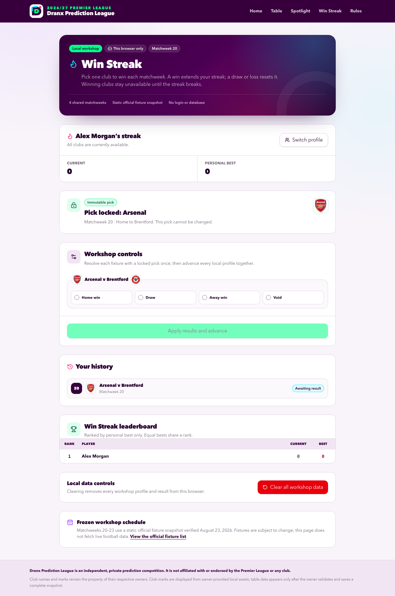
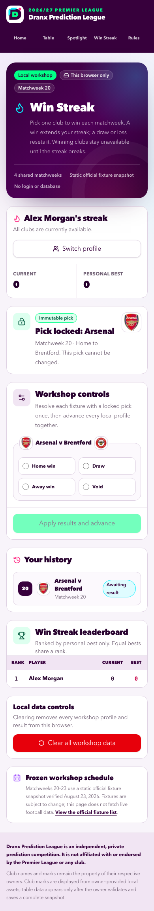

# Win Streak workshop

- **Date:** August 23, 2026
- **Status:** Local workshop only; not released or deployed
- **Route:** `/win-streak`
- **Working name:** Win Streak

## Workshop boundary

Win Streak is an interactive, browser-local concept for a midseason Premier League mini game. It reuses the site's Dranx identity, responsive layout, and canonical local club badges, but it doesn't change the table prediction game, spotlight accuracy, or either leaderboard.

The workshop has the following technical boundaries:

- It stores profiles, picks, and shared results only in versioned `localStorage` in the active browser, then derives streaks from those local facts.
- It doesn't read from or write to Neon, call a route handler or server action, set an identity cookie, or contact a football-data service at runtime.
- It doesn't create an account or verify that a display name belongs to a particular person. Anyone using the same browser can switch to any local workshop profile.
- It includes a static four-round fixture snapshot for Matchweeks 20-23. The workshop doesn't refresh that snapshot when the official schedule changes.
- It has no clock or deadline simulation. A profile can make its active-round pick until the local workshop controls advance the shared round.
- It doesn't imply a production release, database migration, administrator workflow, GitHub merge, or Vercel deployment.

Use **Clear all workshop data** to remove every local profile, pick, outcome, and derived streak, and to return the workshop to Matchweek 20. Browser storage deletion has the same effect. The workshop has no recovery service.

## Participant flow

### Create or resume a profile

Enter a display name with 2-40 characters. The workshop normalizes the name before matching it to a local profile. If the normalized name already exists, the browser resumes that profile. Otherwise, the browser creates a profile.

Profiles share one round timeline and one leaderboard. Use **Switch profile** to test another participant without opening a different browser. A late profile joins the active round with a current and best streak of zero; earlier rounds don't count as missed picks.

### Choose a club

After the profile opens, choose one available club to win its fixture in the active round. A draw doesn't count as a win.

Review the club, opponent, venue, and round before confirming. Each profile can confirm one pick in a shared round. A confirmed pick is immutable: switching profiles, reloading the page, or reopening the profile doesn't make it editable.

More than one profile can pick the same club. Profiles can also pick opposite clubs in the same fixture. The shared result applies consistently to every affected profile.

### Resolve and advance the shared round

The local workshop controls list each distinct fixture that contains at least one confirmed pick. Resolve each listed fixture as **Home win**, **Draw**, **Away win**, or **Void**, then apply the results and advance every profile together.

The controls record only the outcome needed by the workshop. They don't collect a scoreline. If profiles picked opposite clubs in one fixture, a home or away result increments one side and resets the other. A draw resets both sides, and a void preserves both sides.

If no profile made a pick, advance the round without entering an outcome. After Matchweek 23 resolves, the workshop ends with the final local leaderboard. Use **Clear all workshop data** to replay it.

## Streak rules

The workshop derives every profile's current and best streak from its confirmed picks and the shared outcomes. It doesn't store an editable leaderboard score.

| Round result             | Current streak | Best streak                                        | Club availability                                                                                        |
| ------------------------ | -------------- | -------------------------------------------------- | -------------------------------------------------------------------------------------------------------- |
| Picked club wins         | Add one        | Keep the greater of the old best or current streak | Keep every winning club from the active streak unavailable                                               |
| Picked club draws        | Reset to zero  | Preserve                                           | Make all clubs available in the next round                                                               |
| Picked club loses        | Reset to zero  | Preserve                                           | Make all clubs available in the next round                                                               |
| Picked fixture is void   | Preserve       | Preserve                                           | Return the voided club to the available pool; retain restrictions from earlier wins in the active streak |
| Profile misses the round | Preserve       | Preserve                                           | Retain every restriction from earlier wins in the active streak                                          |

A club becomes unavailable only after it produces a win in the profile's active streak. The club stays unavailable through later wins, missed rounds, and void results. A draw or loss breaks the streak and unlocks the complete 20-club pool.

For example, a profile that wins with Arsenal and Liverpool has a current and best streak of two. Both clubs stay unavailable. If the profile then misses a round, both remain unavailable and the current streak stays at two. If its next pick draws or loses, the current streak becomes zero, the best stays two, and all clubs become available.

## Leaderboard rules

The Win Streak leaderboard stays separate from the site's table and spotlight leaderboards.

- Rank profiles by best streak, from highest to lowest.
- Give equal best streaks the same competition rank. Scores `3, 3, 1` receive ranks `1, 1, 3`.
- Sort tied names alphabetically for stable presentation. The alphabetical order isn't a tiebreaker.
- Show current streak as supporting information only. It doesn't affect rank.
- Keep profiles with a best streak of zero on the leaderboard so every local participant remains visible.

No profile is eliminated. A draw or loss starts another attempt in the next shared round while the best streak remains on the leaderboard.

## Static workshop fixtures

The workshop contains the following Matchweek 20-23 snapshot. Club names map to the repository's canonical 2026/27 team fixture and local badge paths.

### Matchweek 20 — January 6, 2027

| Home                   | Away              |
| ---------------------- | ----------------- |
| Arsenal                | Brentford         |
| Brighton & Hove Albion | AFC Bournemouth   |
| Crystal Palace         | Chelsea           |
| Everton                | Aston Villa       |
| Fulham                 | Tottenham Hotspur |
| Ipswich Town           | Coventry City     |
| Leeds United           | Manchester City   |
| Manchester United      | Newcastle United  |
| Nottingham Forest      | Hull City         |
| Sunderland             | Liverpool         |

### Matchweek 21 — January 16, 2027

| Home              | Away                   |
| ----------------- | ---------------------- |
| AFC Bournemouth   | Ipswich Town           |
| Aston Villa       | Manchester United      |
| Brentford         | Brighton & Hove Albion |
| Chelsea           | Sunderland             |
| Coventry City     | Everton                |
| Hull City         | Arsenal                |
| Liverpool         | Crystal Palace         |
| Manchester City   | Nottingham Forest      |
| Newcastle United  | Fulham                 |
| Tottenham Hotspur | Leeds United           |

### Matchweek 22 — January 23, 2027

| Home                   | Away              |
| ---------------------- | ----------------- |
| Arsenal                | Newcastle United  |
| Brighton & Hove Albion | Manchester City   |
| Crystal Palace         | Tottenham Hotspur |
| Everton                | Brentford         |
| Fulham                 | Aston Villa       |
| Ipswich Town           | Hull City         |
| Leeds United           | Chelsea           |
| Manchester United      | Liverpool         |
| Nottingham Forest      | AFC Bournemouth   |
| Sunderland             | Coventry City     |

### Matchweek 23 — January 30, 2027

| Home              | Away                   |
| ----------------- | ---------------------- |
| AFC Bournemouth   | Fulham                 |
| Aston Villa       | Ipswich Town           |
| Brentford         | Manchester United      |
| Chelsea           | Nottingham Forest      |
| Coventry City     | Leeds United           |
| Hull City         | Crystal Palace         |
| Liverpool         | Everton                |
| Manchester City   | Arsenal                |
| Newcastle United  | Brighton & Hove Albion |
| Tottenham Hotspur | Sunderland             |

## Source verification

The fixture and concept sources were verified on August 23, 2026:

| Official source                                                                                                                                                        | Workshop use                                                   |
| ---------------------------------------------------------------------------------------------------------------------------------------------------------------------- | -------------------------------------------------------------- |
| Premier League, [All 380 fixtures for 2026/27 Premier League season](https://www.premierleague.com/en/news/4675097/all-380-fixtures-for-202627-premier-league-season/) | Matchweek 20-23 dates and home-away pairings                   |
| Premier League, [Play Last Fan Standing for chance to win a GRAND PRIZE](https://www.premierleague.com/en/news/4685390/premier-league-last-fan-standing-202627)        | Reference for the one-club-per-matchweek, win-required premise |

The Premier League fixture release states that fixtures are subject to change. This workshop intentionally freezes the August 23, 2026 snapshot because it has no runtime schedule feed. Verify and import a reviewed schedule through an approved workflow before considering a released version.

The official Last Fan Standing game eliminates a participant after a draw or loss and prevents reuse of every previous club. Win Streak is a separate, unofficial workshop: it resets the current streak instead of eliminating the profile, preserves missed rounds, returns a voided club to the pool, and unlocks the club pool after a draw or loss.

## Local validation and storage behavior

The browser stores version 1 under `dranx-win-streak-workshop:2026-27:v1`. It accepts at most 50 profiles and 128 KB of serialized workshop state. Each profile can contain at most one pick in each of the four static rounds, and each resolved round can contain only its 10 known fixtures.

The browser accepts only the known workshop version, canonical club and fixture identifiers, one pick per profile and round, and the four supported result values. It rejects or discards incompatible, corrupt, oversized, or out-of-scope stored values rather than rendering them as valid game state.

Derived state follows these invariants:

- Every profile advances against the same shared round and shared fixture outcomes.
- A confirmed pick always references one club in that round's fixture list.
- A profile can't pick a club that already won during its unbroken current streak.
- A round result applies once, then the round becomes historical and immutable.
- Current streak, best streak, unavailable clubs, and leaderboard rank recompute from validated history.
- Reloading the route restores the same validated profiles, active round, immutable picks, shared outcomes, and derived leaderboard.

## Browser evidence

The newest evidence was captured on August 23, 2026, from the optimized local production build running through the isolated-database wrapper. Both full-page images were visually inspected after capture. They show one browser-local profile with an immutable Arsenal pick, the shared result control, history, leaderboard, reset boundary, and official-source note.

### Desktop

### Mobile

The focused production-browser matrix passed 25 of 25 journeys across desktop Chromium, 390-pixel mobile Chromium, 320-pixel Chromium, 430-pixel Chromium, and mobile WebKit. It covered light and dark color schemes, a 37-character display name, document-level overflow, profile switching, immutable review, reload persistence, opposite picks in one fixture, win, draw, loss, missed, and void handling, shared ranks, reset, console and page errors, and the absence of `/api` or external runtime requests.

## Acceptance checklist

- [x] A 2-40 character display name creates or resumes a switchable local profile.
- [x] The active profile can review and confirm one immutable pick per shared round.
- [x] Winning clubs stay unavailable until the streak breaks; draw and loss reset the current streak and unlock all clubs.
- [x] Missed and void rounds preserve the streak; a void returns that round's club to the pool.
- [x] One fixture outcome resolves every profile pick on that fixture and advances the shared round once.
- [x] Late profiles receive no retroactive penalty.
- [x] The leaderboard uses best streak only, shared competition ranks, and alphabetical tied names.
- [x] Reloading restores validated local state, and **Clear all workshop data** returns the route to its initial state.
- [x] Desktop, 390-pixel mobile, 320-pixel, and 430-pixel layouts have no document-level horizontal overflow.
- [x] The route preserves its readable layout in the site's light and dark color schemes.
- [x] Keyboard users can create or switch profiles, select a club, review a pick, confirm it, resolve workshop fixtures, and clear local data.
- [x] The page makes no `/api/` or external-origin browser request and has no database, server mutation, deployment, or production-data dependency.
- [x] The canonical Markdown and generated HTML peer pass `npm run docs:check`.
