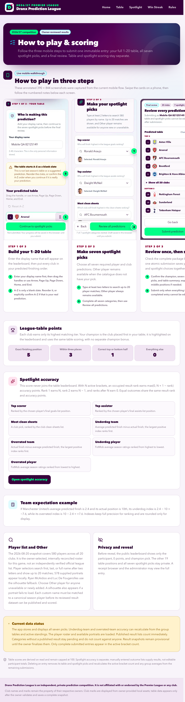
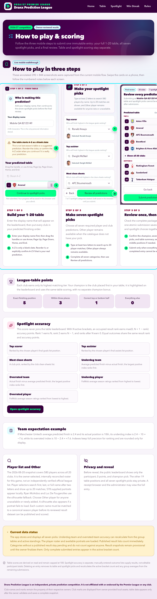
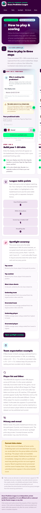
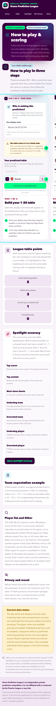

# UX audit: Dranx Prediction League

```text
═══════════════════════════════════════════════════════════
VERDICT: Conditional Pass

Persona Lock: invited-football-fan (inferred for this audit)
Locked at: 2026-08-23 21:11 CDT
Surfaces audited: 13 / 13 user-interface routes
Interaction Manifest: complete (117 timestamped entries)

Hard Gates after remediation:
  Console errors:        0   GREEN ✓   (0 allowlisted)
  Console warnings:      0   GREEN ✓   (0 allowlisted)
  Network 5xx:           0   GREEN ✓
  Network 403/404 auth:  0   GREEN ✓   (0 allowlisted)
  Layout collapse:       0   GREEN ✓
  axe-core Critical:     0   GREEN ✓   (0 allowlisted)
  axe-core Serious:      0   GREEN ✓   (0 allowlisted)

Performance (production baseline, / to /leaderboard):
  LCP:   0.548s  GREEN ✓   (threshold 4.0s)
  CLS:   0.05    GREEN ✓   (threshold 0.25)
  INP:   56ms    GREEN ✓   (threshold 500ms)
  Load:  0.915s  GREEN ✓   (pragmatic readiness threshold 5.0s)

Findings after remediation:
  Critical: 0
  High:     0 open / 1 fixed
  Medium:   1 open / 2 fixed
  Low:      0 open

Time per phase:
  Phase 1 (pre-flight):    6m
  Phase 2 (discovery):     7m
  Phase 3 (walkthrough):  24m
  Phase 4 (polish):       18m
  Phase 5 (stress):       12m
  Total:                  67m

Manifest plausibility:
  Manifest entries:       117
  Time span first→last:   43.1m
  Median gap between:     1.633s
  Screenshots captured:   113
  Console reads:          35
  Network probes:         30

Self-critique pass (sub-agent):
  Drafted: 7   Kept: 5   Generic moved to polish: 2   Duplicate merged: 1

TOP 5 (ranked by impact × ease):
  1. F-1 Rules carousel accessibility and containment
  2. F-3 Clear motion for high-consequence confirmation dialogs
  3. F-2 Continuous feedback for searchable dropdowns
  4. P-1 Orienting transition between prediction stages
  5. P-2 Calibrated success acknowledgement after submission
═══════════════════════════════════════════════════════════
```

**Date:** August 23, 2026  
**Production baseline:** [pl-predictions-2026.vercel.app](https://pl-predictions-2026.vercel.app)  
**Fixed candidate:** Optimized local production server with an isolated Neon database  
**Persona:** An invited Premier League fan with moderate technical comfort, using a phone while distracted and trying to submit quickly.  
**Browser:** Playwright Chromium, desktop and mobile profiles  
**Viewports:** 320, 375, 390, 768, 900, 1,024, 1,280, 1,440, and 1,920 pixels  
**Reference extract:** None. The existing visual system is the reference.

## Executive summary

The product's primary flows are coherent, trustworthy, and completable on desktop and mobile. The audit found one serious accessibility failure and one responsive containment failure in the same Rules carousel; both are fixed and verified. Search dropdowns, stage changes, confirmation dialogs, and submission success also have clearer, reduced-motion-safe feedback.

The remaining concern affects returning participants rather than first-time completion. Before predictions are revealed, the private confirmation URL appears on the success card but isn't rediscoverable from the home page or leaderboard after the participant leaves it. The audit remains a Conditional Pass until that privacy-sensitive product decision is resolved.

## Coverage

| Dimension              | Tested | Total | Coverage | Notes                                                                                     |
| ---------------------- | -----: | ----: | -------: | ----------------------------------------------------------------------------------------- |
| User-interface routes  |     13 |    13 |     100% | Public, receipt-only, login, and six authenticated administrator routes                   |
| Core control classes   |     16 |    16 |     100% | Navigation, reorder, forms, selectors, dialogs, links, radios, and administrator previews |
| End-to-end threads     |      3 |     3 |     100% | Prediction, Win Streak, and administrator review                                          |
| Scenario battery       |     10 |    11 |      91% | A 500-profile saturated Win Streak state wasn't generated                                 |
| Responsive widths      |      9 |     9 |     100% | Includes exact 320- and 430-pixel product boundaries                                      |
| Major component states |      6 |     6 |     100% | Default, loading, empty, partial, error, and disabled states                              |

No production mutation ran. Prediction and Win Streak writes used the isolated test database. Administrator result, standings, lock, and reveal controls were inspected without saving, publishing, locking, or revealing.

Final cleanup removed the two audit prediction parents with their 40 table rows and 14 spotlight picks, plus the two audit Win Streak profiles with their two picks. Cascade read-back found zero residue; the isolated Win Streak rate-limit scopes and administrator sessions were also zero.

The uninterrupted final `CI=1 npm run check` passed 18 documentation pairs, the 580-player/578-portrait validator, formatting, ESLint, strict TypeScript, 414 unit/component tests with 31 guarded skips, all 29 isolated Neon integration tests, the Next.js 16 Webpack production build, 24 pre-kickoff browser journeys with 26 intentional routing skips, and three post-kickoff journeys with two intentional skips.

## Before and after

The desktop pair records the carousel containment change at a narrow desktop width. The mobile pair shows the new keyboard focus treatment around the carousel.

| Desktop before                                                                                           | Desktop after                                                                                          |
| -------------------------------------------------------------------------------------------------------- | ------------------------------------------------------------------------------------------------------ |
|  |  |

| Mobile before                                                                                          | Mobile after                                                                                        |
| ------------------------------------------------------------------------------------------------------ | --------------------------------------------------------------------------------------------------- |
|  |  |

## Findings

### Fixed high-severity finding

#### F-1: Rules carousel wasn't keyboard reachable and widened the page

- **Layer:** Interaction and responsive layout
- **Surface:** `/rules`
- **Viewports:** 390 and 768 pixels
- **Persona:** Invited football fan

**Reproduce the original behavior:**

1. Open `/rules` at 390 pixels.
2. Move through the page with the Tab key.
3. Observe that focus skips the horizontally scrollable three-step walkthrough.
4. Resize the page to 768 pixels.
5. Compare `documentElement.scrollWidth` with `clientWidth`.

**Observed:** axe-core reported the serious `scrollable-region-focusable` rule. At 768 pixels, the document was 776 pixels wide in a 768-pixel viewport.

**Expected:** The carousel is named and keyboard focusable, and its internal scroll doesn't widen the document.

**Evidence:** The before and after screenshots in this report, the pre-fix axe record, and the responsive sweep. The post-fix sweep reports `scrollWidth === clientWidth` at every tested width and zero axe violations.

**Location:** `src/components/how-to-play.tsx`

**Fix:** Add a named tab stop with the site's standard visible focus ring. Remove the medium-breakpoint negative margin that escaped the page container while preserving snap scrolling inside the carousel.

### Fixed medium-severity findings

#### F-2: Search dropdowns disappeared without close feedback

- **Layer:** Feedback
- **Surface:** Prediction spotlight selectors
- **Viewports:** Desktop and mobile

**Reproduce the original behavior:**

1. Continue to prediction Step 2.
2. Open a player or team selector.
3. Select an option, press Escape, or move focus outside the selector.

**Observed:** The option surface unmounted immediately, which made the state change feel abrupt on touch devices.

**Expected:** The surface grows from its trigger, closes quickly toward the same origin, and becomes unavailable to assistive technology during its visual exit.

**Evidence:** The focused component tests verify the open and closing contracts, the 150-millisecond close cleanup, single-open-selector behavior, and keyboard selection. Browser inspection measured a 250-millisecond open transition and a bottom-center origin on mobile.

**Location:** `src/features/predictions/searchable-prediction-select.tsx` and `src/app/globals.css`

**Fix:** Apply the shared dropdown transition, retain the surface during its close frame, mark it `aria-hidden` while closing, and remove it when the CSS duration expires.

#### F-3: Important confirmation dialogs appeared without orientation feedback

- **Layer:** Feedback
- **Surfaces:** Prediction review, A-Z warning, Win Streak review, result publication, and irreversible season actions
- **Viewports:** Desktop and mobile

**Reproduce the original behavior:**

1. Open any listed confirmation dialog.
2. Close it with Escape or its cancel action.

**Observed:** The overlay and panel appeared and disappeared abruptly, including on irreversible actions.

**Expected:** A short centered scale and fade make the new layer legible without delaying the action. Reduced-motion users receive the final state with no animation.

**Evidence:** The post-fix browser inspection reports `t-modal-open` on participant dialogs, focus remains trapped, Escape closes nonpending dialogs, and axe, console, and network results remain clean.

**Location:** The dialog components under `src/features/` and `src/app/admin/`, with shared rules in `src/app/globals.css`

**Fix:** Add tuned 250-millisecond entry, 150-millisecond exit, overlay fades, and reduced-motion guards. Positioning uses the independent CSS `translate` property so scaling doesn't disturb centered dialogs.

### Open medium-severity finding

#### F-4: A participant can't rediscover their private confirmation URL

- **Layer:** Architecture and returning-user experience
- **Surfaces:** `/`, `/leaderboard`, and `/entries/[id]`
- **Viewport:** All

**Reproduce:**

1. Submit a prediction before reveal.
2. Open the private confirmation from the success card.
3. Navigate to the leaderboard, then return home without the copied URL.

**Observed:** The receipt still authorizes the direct entry route, but no public page can rediscover the entry identifier. The pre-reveal leaderboard correctly renders the participant name as plain text to avoid exposing identifiers.

**Expected:** A participant has a privacy-preserving way to return to their own confirmation without exposing unrevealed entry identifiers to other visitors.

**Evidence:** The isolated round trip authorized the exact receipt URL, while home returned to a new-entry form and the pre-reveal leaderboard exposed no link.

**Location:** `src/features/predictions/receipt.ts`, `src/features/leaderboard/leaderboard-board.tsx`, and the post-submit client state

**Suggested decision:** Choose a deliberate private recovery design, such as a scoped client-side recent-entry pointer with an explicit clear action. Don't widen the HttpOnly receipt cookie or serialize unrevealed identifiers into public HTML without a separate privacy review.

## Motion polish that wasn't counted as a defect

The independent critique moved two changes out of the formal finding count because the original states remained understandable:

- Prediction Step 1 and Step 2 use a 16-pixel cross-blur panel reveal that preserves the user's place.
- Successful prediction submission draws a calibrated check path. Browser measurement found a 22.63-unit path, so the 24-unit dash safely covers it.

Both treatments disable motion when `prefers-reduced-motion: reduce` is active. The Impeccable detector reports no remaining visual anti-pattern warnings in the changed UI files.

## Thread results

### Submit a complete prediction

- **Completable end to end:** Yes.
- **Input coverage:** A real display name, keyboard table reordering, six catalogue choices, one Other-player path, review, submit, receipt-only confirmation, and leaderboard projection.
- **Dead ends:** None.
- **Interrupt recovery:** The browser draft survived an offline reload failure and restored after connectivity returned.
- **End state:** Clear immutable success with confirmation and leaderboard actions.
- **Remaining friction:** The confirmation isn't rediscoverable after the participant leaves the success state.

Two-minute guide: Enter the name that you want on the leaderboard. Reorder all 20 clubs, or explicitly confirm that A-Z is your real prediction. Choose all seven spotlight picks, review the full package, and submit once.

### Create and lock a Win Streak pick

- **Completable end to end:** Yes.
- **Input coverage:** New receipt-bound profile, club selection, immutable review, confirmed pick, immediate public leaderboard reflection, and reload persistence.
- **Dead ends:** None.
- **End state:** The participant sees the locked club, opponent, matchweek, history, and public row.

Two-minute guide: Create the browser-bound profile, choose one available club to win the open matchweek, review the opponent and kickoff, and confirm. The pick is immediately public and can't be edited.

### Review administrator workflows

- **Completable:** Yes for authentication, navigation, parsing inputs, validation previews, and confirmation dialogs. Mutations were intentionally not completed.
- **Surfaces:** Control room, submissions, standings, spotlight results, settings, and Win Streak results.
- **Safety:** Exact destructive phrases, disabled states, warning copy, focus traps, and cancel behavior remained clear.
- **Production impact:** None.

## Interaction manifest summary

```text
INTERACTION MANIFEST — Coverage
  Total timestamped entries: 117
  Interaction-first snapshots: 47
  Pages with complete route probes: 13 / 13
  First entry: 2026-08-23 21:11:34 CDT
  Last entry:  2026-08-23 21:54:42 CDT
  Median gap: 1.633 seconds
```

The route probes recorded a screenshot, axe result, width measurement, console read, and HTTP response listener for every public and administrator surface. Manual entries record real clicks, typing, keyboard reordering, selector choices, modal confirmation, submissions, receipt navigation, and recovery checks.

## Responsive matrix

| Route group                  | 1,920 | 1,440 | 1,280 | 1,024 | 900 | 768 | 390 | 375 | 320 |
| ---------------------------- | :---: | :---: | :---: | :---: | :-: | :-: | :-: | :-: | :-: |
| Public navigation and heroes |   ✓   |   ✓   |   ✓   |   ✓   |  ✓  |  ✓  |  ✓  |  ✓  |  ✓  |
| Prediction flow              |   ✓   |   ✓   |   ✓   |   ✓   |  ✓  |  ✓  |  ✓  |  ✓  |  ✓  |
| Rules and walkthrough        |   ✓   |   ✓   |   ✓   |   ✓   |  ✓  |  ✓  |  ✓  |  ✓  |  ✓  |
| Table and spotlight results  |   ✓   |   ✓   |   ✓   |   ✓   |  ✓  |  ✓  |  ✓  |  ✓  |  ✓  |
| Win Streak                   |   ✓   |   ✓   |   ✓   |   ✓   |  ✓  |  ✓  |  ✓  |  ✓  |  ✓  |
| Administrator routes         |   ✓   |   ✓   |   ✓   |   ✓   |  ✓  |  ✓  |  ✓  |  ✓  |  ✓  |

The walkthrough intentionally retains internal horizontal overflow below 1,024 pixels. No tested page has document-level horizontal overflow after remediation.

## Scenario battery

| Scenario               | Result         | Evidence                                                                                                  |
| ---------------------- | -------------- | --------------------------------------------------------------------------------------------------------- |
| First contact          | Pass           | Primary actions, permanence, privacy, and scoring are explained in place                                  |
| Interrupted workflow   | Pass           | Offline reload failed as expected; the draft restored with the exact name after reconnect                 |
| Wrong turn recovery    | Pass           | Back-to-table, modal cancel, Escape, and navigation preserved expected state                              |
| Returning user         | Conditional    | Win Streak resumes; private prediction confirmation has finding F-4                                       |
| Keyboard only          | Pass           | Reorder, selectors, carousel, dialogs, and Win Streak are operable with visible focus                     |
| Heavy data             | Partial        | The 580-player search and 20-team tables passed; a synthetic 500-profile board wasn't created             |
| Destructive confidence | Pass           | Immutable participant actions have final review; administrator irreversible actions require exact phrases |
| Second role            | Pass           | Anonymous, receipt holder, and administrator boundaries behaved distinctly                                |
| Lifecycle position     | Pass           | Empty, partial, populated, open, and revealed states remained coherent                                    |
| Round trip             | Pass           | Both participant writes reflected in their intended read surfaces                                         |
| Data seasoning         | Not applicable | Fixture and season dates are fixed domain data rather than generated demo timestamps                      |

## Stress results

| Recipe                     | Result         | Finding                                                  |
| -------------------------- | -------------- | -------------------------------------------------------- |
| Reduced motion             | Pass           | Shared transitions resolve immediately with no animation |
| Offline interruption       | Pass           | Validated local draft restored after reconnect           |
| Long and accented names    | Pass           | Apostrophes and diacritics wrap and persist correctly    |
| Exact 320-pixel reflow     | Pass           | No document overflow                                     |
| Keyboard and focus trap    | Pass           | No blocker after F-1                                     |
| Empty and populated states | Pass           | Public and administrator branches remain understandable  |
| Dark mode                  | Pass           | Existing semantic color system remains intact            |
| RTL and CJK                | Not applicable | The product doesn't advertise localization               |
| Print                      | Not applicable | No print workflow exists                                 |

## Component states

| Component           | Default | Loading | Empty | Partial | Error | Disabled | Notes                                                     |
| ------------------- | :-----: | :-----: | :---: | :-----: | :---: | :------: | --------------------------------------------------------- |
| Prediction form     |    ✓    |    ✓    |   ✓   |    ✓    |   ✓   |    ✓     | Player-catalogue fallback and validation summary included |
| Search selector     |    ✓    |    ✓    |   ✓   |    ✓    |   ✓   |    ✓     | Other player remains available                            |
| Review dialogs      |    ✓    |   n/a   |  n/a  |   n/a   |   ✓   |    ✓     | Pending state blocks dismiss and duplicate submit         |
| Win Streak panel    |    ✓    |    ✓    |   ✓   |    ✓    |   ✓   |    ✓     | Anonymous, profile, open-pick, and locked-pick states     |
| Result pages        |    ✓    |    ✓    |   ✓   |    ✓    |   ✓   |    ✓     | Pending datasets and no-standings branch included         |
| Administrator desks |    ✓    |    ✓    |   ✓   |    ✓    |   ✓   |    ✓     | Safe previews only during this audit                      |

## What works well

- The three-stage prediction flow explains permanence before the irreversible write and keeps review compact without hiding the full table.
- The table reorder control supports pointer, touch, and a documented keyboard model with useful live announcements.
- Search keeps the 580-player catalogue out of initial HTML, limits results, announces counts, and preserves an Other-player escape hatch.
- Win Streak is understandable before profile creation and shows the public consequence of a pick before confirmation.
- Administrator actions use strong server-side safety boundaries and confirmation copy that matches the consequence.
- The visual system has consistent spacing, radii, type hierarchy, semantic colors, touch targets, and dark-mode behavior.

## Fix and verify

| Item                                             | Severity | Result | Verification                                                              |
| ------------------------------------------------ | -------- | ------ | ------------------------------------------------------------------------- |
| F-1 Rules carousel accessibility and containment | High     | Fixed  | Component regression, axe clean, 320-1,920 sweep clean                    |
| F-2 Dropdown close continuity                    | Medium   | Fixed  | Focused tests and real mobile keyboard/pointer flow                       |
| F-3 Confirmation dialog orientation              | Medium   | Fixed  | Participant and administrator dialogs, Escape, focus trap, reduced motion |
| P-1 Stage reveal                                 | Polish   | Added  | Real Step 1-to-2 flow and reduced-motion emulation                        |
| P-2 Success check                                | Polish   | Added  | Real submission and measured SVG path length                              |
| F-4 Confirmation rediscovery                     | Medium   | Open   | Product and privacy decision required                                     |

## Recommended regression tests

1. Keep the Rules carousel axe assertion and 768-pixel `scrollWidth === clientWidth` check.
2. Keep the selector close-retention test synchronized with `--dropdown-close-dur`.
3. Assert that every Radix confirmation dialog uses the shared modal transition and reduced-motion guard.
4. Preserve the production-server prediction and Win Streak round trips in the browser matrix.
5. Add a recovery test when the owner chooses a design for F-4.

## Hold this in your hands

Dranx feels like a careful competition sheet that has learned how to guide people without becoming heavy. The important choices are visible, the irreversible moments ask for attention, and both games end with an unambiguous public or private result. On a phone, the product handles a surprising amount of information without turning into a cramped desktop table. The audit's fixed issues were concentrated in one instructional carousel and in the feel of state changes, not in broken core logic. The remaining gap appears only after success: the browser remembers that a participant owns an entry, but the interface can't help them find it again. Resolve that one privacy-sensitive return path, and the product can move from a cautious recommendation to a straightforward one.
